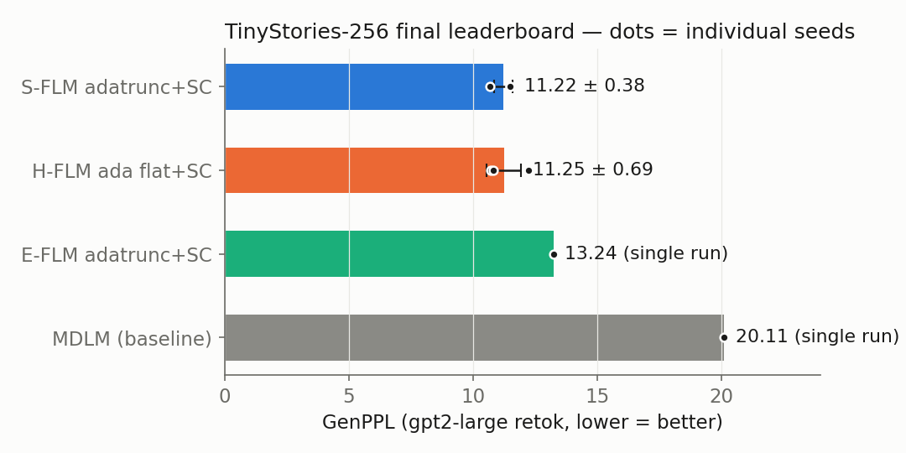
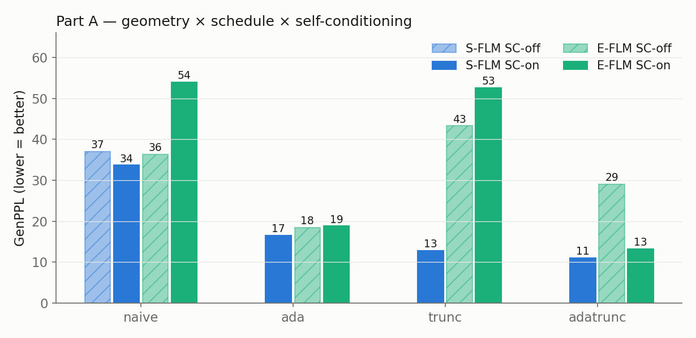
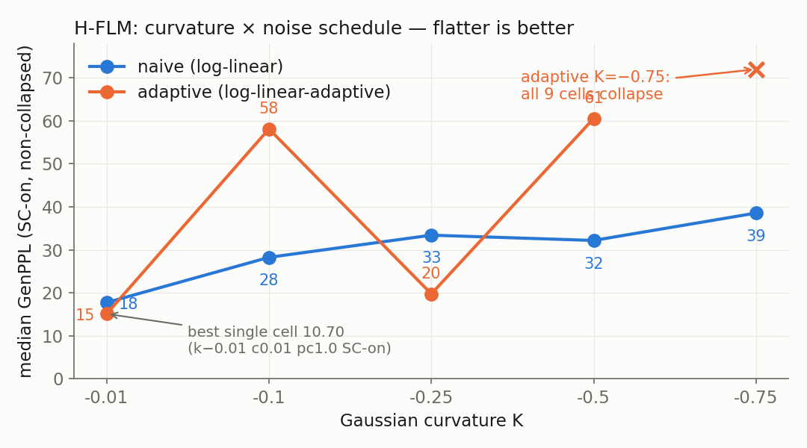
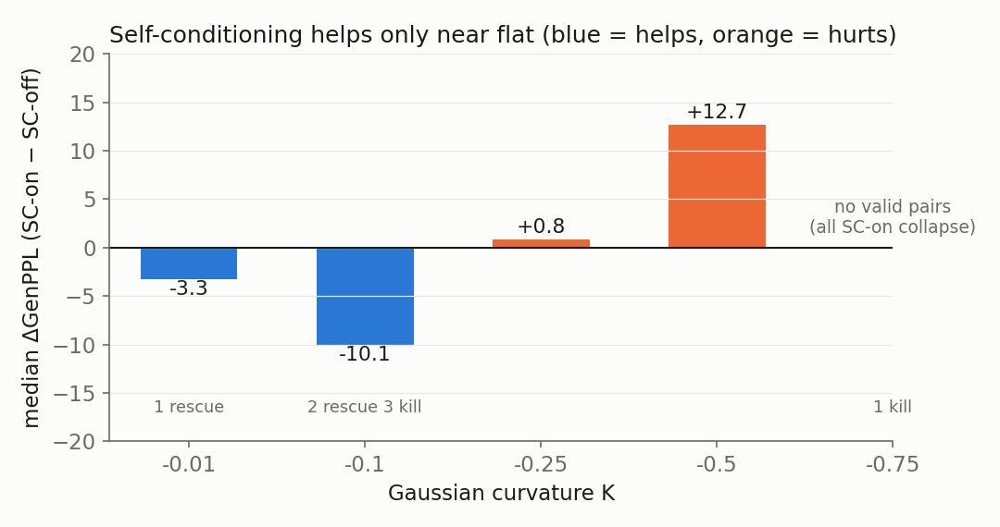
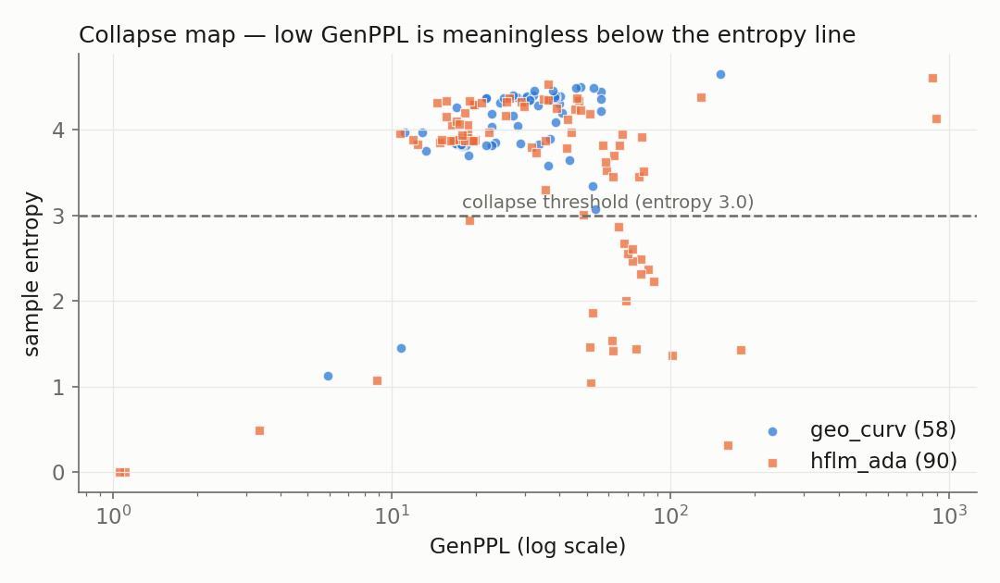

# TinyStories-256 Geometry Program — Final Results

**155 training runs** across 4 experiments (2026-07): `geo_curv_sc_tinystories_256` (58),
`hflm_ada_sc_tinystories_256` (90), `seed_errbar_tinystories_256` (6), MDLM baseline (1).
Common recipe: small DiT (768/12/12), 30k steps, global batch 512, seq 256, bf16, EMA 0.9999,
AdamW lr 3e-4. **Metric: GenPPL** (gpt2-large retokenized generative perplexity, lower =
better), read **with entropy** — entropy < 3.0 flags degenerate/repetitive collapse (a
collapsed cell's low GenPPL is meaningless). Per-cell tables: each experiment's `RESULTS.md`.

---

## 1. Final leaderboard (seed-verified)

| model (best config) | GenPPL | evidence |
|---|---|---|
| **S-FLM adatrunc + SC** (`noise=log-linear-adaptive, α_max=0.121`) | **11.22 ± 0.38** | seeds {10.68, 11.48, 11.50} |
| **H-FLM ada near-flat + SC** (`K=−0.01, init c0.01, prior_cov 1.0`) | **11.25 ± 0.69** | seeds {10.70, 10.83, 12.23} |
| E-FLM adatrunc + SC (`α_max=0.840`) | 13.24 | single run |
| MDLM (baseline, existing ckpt, ent 4.41) | 20.11 | single run |

**Verdict: S-FLM and near-flat H-FLM are statistically TIED** (Δmean 0.03 ≪ error bars).
The single-run "H-FLM 10.70 beats S-FLM 11.08" did **not** survive seeding — it was a
favorable draw. S-FLM is the more consistent geometry (σ 0.38 vs 0.69). All FLM geometries
beat MDLM by a wide margin (entropy caveat: MDLM samples are more diverse, 4.41 vs ~3.96).

## 2. Part A — geometry × schedule × self-conditioning (13 cells)

| variant | S-FLM off / on | E-FLM off / on |
|---|---|---|
| naive | 37.1 / 33.7 | 36.3 / 53.9 |
| ada | — / 16.6 | 18.4 / 18.8 |
| trunc | — / 12.8 | 43.3 / 52.6 |
| **adatrunc** | — / **11.1** | 29.0 / **13.2** |

- **Adaptive schedule is the dominant lever** (~2–3× GenPPL) in both geometries; truncation
  stacks on top for S-FLM (16.6 → 11.1).
- **E-FLM interaction:** truncation alone *hurts* (36→43) and SC alone *hurts* (36→54),
  yet ada+trunc+SC jointly give E-FLM its best (13.2). Components individually harmful,
  jointly good.

## 3. H-FLM curvature × schedule (90 + 45 cells, SC-on medians)

| K | naive med | ada med | ada best cell |
|---|---|---|---|
| −0.01 | 17.7 | **15.1** | **10.70** |
| −0.1 | 28.3 | 58.1 | 14.56 |
| −0.25 | 33.4 | 19.8 | 17.88 |
| −0.5 | 32.2 | 60.6 | 35.49 |
| −0.75 | 38.6 | **all 9 collapse** | — |

- **Flatter is better, from both directions.** Naive degrades monotonically with depth;
  adaptive is bimodal (good at −0.01/−0.25) and **catastrophic at −0.75** (9/9 collapse).
- **ada helps H-FLM only near flat** (median 15.1 vs 17.7 at K=−0.01; best 10.70 vs 16.96)
  and destabilizes deep curvature. Head-to-head over matched cells (collapse = loss):
  naive 27, ada 18 — ada trades depth-robustness for peak performance.

## 4. Self-conditioning (matched pairs, adaptive H-FLM)

| K | median Δ (on−off) | rescues / kills |
|---|---|---|
| −0.01 | **−3.3** (helps) | 1 / 0 |
| −0.1 | −10.1 (chaotic) | 2 / 3 |
| −0.25 | +0.8 (neutral) | 0 / 0 |
| −0.5 | **+12.7** (hurts) | 0 / 0 |
| −0.75 | no valid pairs | 0 / 1 |

**SC helps only near flat** (and rescues small-init collapse there); it is neutral-to-harmful
at depth. Same "helpers help only near flat" rule as the adaptive schedule.

## 5. Stability

Collapses: geo_curv **2/58** vs hflm_ada **25/90** — the adaptive schedule is a
high-variance strategy (sharpens best case, widens failure tail). Fragile zones: K=−0.1
(any schedule), prior_cov 0.8, deep-K + ada, small-init + SC-off.

## 6. Variance calibration (methodological)

- Seed σ ≈ 0.4–0.7 GenPPL at the optimum → **single-run margins < ~1.5 GenPPL are noise**
  in this setup.
- Accidental cross-site duplicates (same config, different cluster/preemption) diverged by
  up to 10 GenPPL (11.88 vs 21.93) — hardware/preemption variance can exceed seed variance.
  All results above are from the canonical Unicorn pool.

## Insights

1. **The schedule is the story, not the geometry.** Lever ranking: adaptive schedule >
   truncation > self-cond (conditional) > geometry (~0 between tuned sphere and tuned
   near-flat hyperboloid). Three geometries, 155 runs: the manifold barely matters on
   TinyStories at this scale.
2. **Curvature is a null result with teeth.** The best H-FLM is the one most nearly
   Euclidean. TinyStories has no hierarchy negative curvature can exploit at 30k steps —
   a real hyperbolic win must be sought where hierarchy is real (Sudoku-like structure,
   deeper text, larger scale).
3. **Aggressive tricks compound failure, not gains.** ada + deep-K + SC stacks collapse
   modes; every helper's benefit is gated on being near flat.
4. **Every FLM beats MDLM ~2×** at this budget (with the entropy/diversity caveat).

## Next steps

1. **H-FLM + truncation + ada** — the one lever H-FLM never got; if it stacks like S-FLM's
   (16.6→11.1), H-FLM could genuinely lead.
2. Entropy-matched MDLM comparison before claiming the 2× gap.
3. Chase curvature only where hierarchy exists, not deeper K on TinyStories.

---
*Reproduction: `experiments/{geo_curv_sc,hflm_ada_sc,seed_errbar}_tinystories_256/sweep.py`;
figures: `figures/tinystories_s256/` (script in session scratchpad). Operational log: `switch.md`.*
