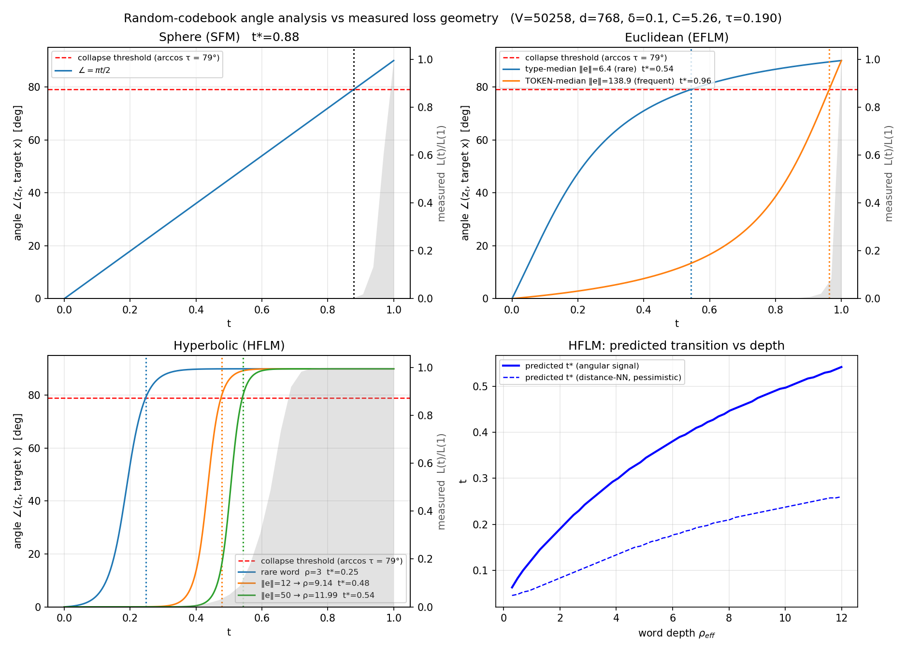
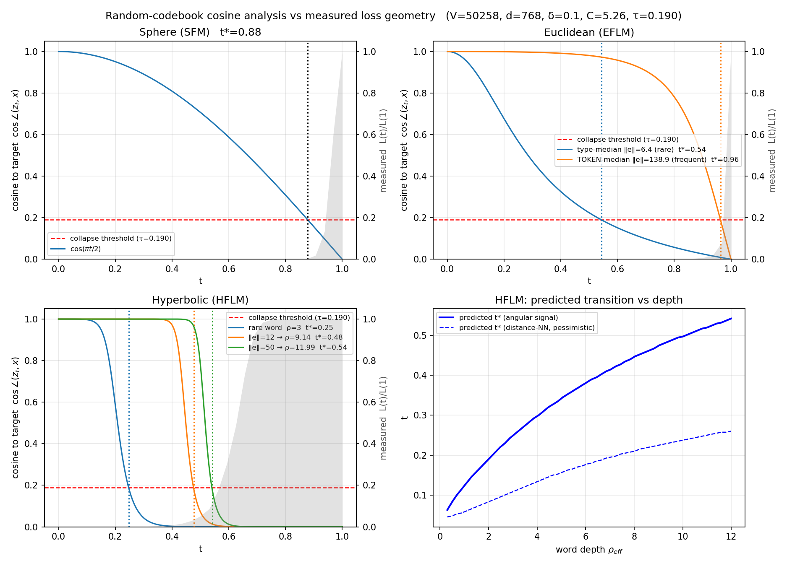

---
marp: true
theme: default
paginate: true
# _class: invert
# color: white
size: 4:3
class: lead
math: katex
style: |
  section.lead h1 {
    text-align: center;
  },
  section.lead h2 {
    text-align: center;
  },
  section.lead h3 {
    text-align: center;
  },
  h1 {
    color: #3d3d3d;
  },
  h2 {
    color: #3d3d3d;
  },
  h3 {
    color: #3d3d3d;
  },
  r {
      color: red;
  },
  y {
      color: yellow;
  },
  b {
      color: blue;
  },
  .g {
      color: green;
  }
---

# Codebook Angle and Cosine vs Loss Geometry

### Two equivalent views of directional signal

`experiments/curv_loss_geo/codebook_angle_vs_lossgeo.png` 
`experiments/curv_loss_geo/codebook_cosine_vs_lossgeo.png`

#### July 24, 2026

---

## View 1 — Target Angle

**Panels 1–3:** colored curves = target angle in degrees (left axis); grey area = normalized loss (right axis). 
**Panel 4:** y axis = transition time $t$. Convention: $t=0$ clean, $t=1$ pure noise.

---

## View 2 — Cosine Similarity

**Panels 1–3:** colored curves = cosine similarity to the target (left axis); grey area = normalized loss (right axis). 
**Panel 4:** y axis = transition time $t$. Convention: $t=0$ clean, $t=1$ pure noise.

---

## Same Directional Signal, Two Y Scales

$$
c(t,k)=\frac{z_t^\top X_k}{\lVert z_t\rVert\,\lVert X_k\rVert},
\qquad
\theta(t,k)=\frac{180}{\pi}\arccos c(t,k).
$$

| view | aligned with target | orthogonal | collapse threshold |
|---|---:|---:|---:|
| cosine $c=\cos\theta$ | $1$ | $0$ | $c=\tau=0.190$ |
| angle $\theta$ | $0^\circ$ | $90^\circ$ | $\theta=79.1^\circ$ |

Both figures contain the same ordering and the same predicted transition time $t^*$.

---

## Angle View: Y Axis = Angle to the Correct Target

For target token $k$, let $X_k$ be its target direction and $z_t$ the state at flow time $t$.

$$
\boxed{
\theta(t,k)
=
\frac{180}{\pi}
\arccos\!\left(
\frac{z_t^\top X_k}{\lVert z_t\rVert\,\lVert X_k\rVert}
\right)
}
$$

- $\theta=0^\circ$: state points exactly toward the correct target
- $\theta=60^\circ$: partial directional alignment
- $\theta=90^\circ$: state is orthogonal to the target; no angular signal remains

For HFLM, this is the angle between **spatial directions**—not hyperbolic geodesic distance.

---

## Calculation Recipe for One Point

At one timestep $t$:

1. Construct the state $z_t$ using the geometry's flow.
2. Normalize: $\hat z_t=z_t/\lVert z_t\rVert$ and $\hat X_k=X_k/\lVert X_k\rVert$.
3. Compute cosine similarity: $c(t,k)=\operatorname{clip}(\hat z_t^\top\hat X_k,-1,1)$.
4. Convert cosine to degrees:

$$
\boxed{\theta(t,k)=\arccos(c(t,k))\times\frac{180}{\pi}}
$$

| cosine $c$ | $1$ | $0.5$ | $0.190$ | $0$ |
|---:|---:|---:|---:|---:|
| angle $\theta$ | $0^\circ$ | $60^\circ$ | $79.1^\circ$ | $90^\circ$ |

---

## Sphere and Euclidean Angles

**Sphere (SFM).** Clean and noise directions are approximately perpendicular:

$$
c_{\mathrm S}(t)=\cos\!\left(\frac{\pi t}{2}\right),
\qquad
\boxed{\theta_{\mathrm S}(t)=90t\ \text{degrees}}
$$

**Euclidean (EFLM).** With $z_t=(1-t)e+t\varepsilon$, $s=\lVert e\rVert$,
$\lVert\varepsilon\rVert\approx\sqrt d$, and $e\perp\varepsilon$:

$$
c_{\mathrm E}(t;s)
=
\frac{(1-t)s}{\sqrt{(1-t)^2s^2+t^2d}},
\qquad
\boxed{\theta_{\mathrm E}(t;s)=\frac{180}{\pi}\arccos c_{\mathrm E}(t;s)}
$$

The two EFLM curves use measured norms $s=6.4$ (type median) and $s=138.9$ (token median).

_Derivation: Appendix A._

---

## Hyperbolic Angle

For HFLM, the Lorentz geodesic's spatial component combines the target direction $u_k$ and an approximately perpendicular noise direction $n$:

$$
D=\operatorname{arccosh}(\cosh\rho_k\cosh\rho_n),
$$

$$
a(t)=\sinh((1-t)D)\sinh\rho_k,
\qquad
b(t)=\sinh(tD)\sinh\rho_n.
$$

Therefore:

$$
\boxed{
\theta_{\mathrm H}(t;\rho_k)
=
\frac{180}{\pi}\arccos\!\left(\frac{a(t)}{\sqrt{a(t)^2+b(t)^2}}\right)
=
\frac{180}{\pi}\operatorname{atan2}(b(t),a(t))
}
$$

Different word depths $\rho_k$ produce different rotation times.

---

## Why the Red Threshold Is $79.1^\circ$

Among $V-1$ random wrong targets in dimension $d$, the high-probability distractor ceiling is

$$
\tau
=
\sqrt{\frac{2\ln(2(V-1)/\delta)}{d}}.
$$

For this figure:

$$
V=50258,\qquad d=768,\qquad\delta=0.1
\quad\Rightarrow\quad
\tau=0.190.
$$

The correct target stops beating the distractor ceiling when $\cos\theta<\tau$:

$$
\boxed{\theta^*=\arccos(\tau)\times\frac{180}{\pi}=79.1^\circ}
$$

- <r>$\theta<79.1^\circ$</r>: target remains distinguishable.
- <r>$\theta>79.1^\circ$</r>: target is likely lost among distractors.

---

## The Other Y Axes

**Grey right axis in Panels 1–3:** measured normalized token-mean cross-entropy

$$
\ell_n(t)=-\log p_\theta(w_n\mid z_{t,n},t),
\qquad
L(t)=\frac{\sum_n m_n\ell_n(t)}{\sum_n m_n},
\qquad
\boxed{y_{\mathrm{grey}}(t)=\frac{L(t)}{L(1)}}.
$$

It answers: **does measured loss rise when $\theta$ crosses $79.1^\circ$—equivalently, when $\cos\theta$ falls below $0.190$?**

**Panel 4 is different:** its y axis is transition time $t$, comparing predicted $t^*$ with measured per-word $t_{10}$ and $t_{50}$.

---

## Takeaway

$$
\boxed{
c(t,k)=\cos\theta(t,k)
=\frac{z_t^\top X_k}{\lVert z_t\rVert\,\lVert X_k\rVert}
}
$$

- The angle and cosine figures show the **same directional signal** on different scales.
- Cosine is direct: $1$ means aligned and $0$ means orthogonal.
- The transition is the same in both views: $c=0.190\iff\theta=79.1^\circ$.
- The grey loss overlay tests whether this geometric transition matches model behavior.

---

# Appendix

## Appendix A1: Deriving the Euclidean cosine curve

---

### Appendix A1 — Set Up the Cosine

The EFLM state interpolates between target embedding $e$ and Gaussian noise $\varepsilon$:

$$
z_t=(1-t)e+t\varepsilon,
\qquad
s=\lVert e\rVert.
$$

Because the target direction is $e$, the plotted cosine is

$$
\boxed{
c_{\mathrm E}(t;s)
=\frac{z_t^\top e}{\lVert z_t\rVert\,s}
}.
$$

So the derivation only needs two quantities:

$$
\text{numerator }z_t^\top e,
\qquad
\text{state norm }\lVert z_t\rVert.
$$

---

### Appendix A1 — Expand Numerator and Norm

Let $q=e^\top\varepsilon$ and $r^2=\lVert\varepsilon\rVert^2$. Direct expansion gives

$$
z_t^\top e
=((1-t)e+t\varepsilon)^\top e
=(1-t)s^2+tq,
$$

$$
\lVert z_t\rVert^2
=(1-t)^2s^2+2t(1-t)q+t^2r^2.
$$

Therefore the exact cosine for one noise draw is

$$
\boxed{
c_{\mathrm E}^{\mathrm{exact}}(t)
=
\frac{(1-t)s^2+tq}
{s\sqrt{(1-t)^2s^2+2t(1-t)q+t^2r^2}}
}.
$$

---

### Appendix A1 — Use the Typical High-Dimensional Noise

For $\varepsilon\sim\mathcal N(0,I_d)$,

$$
q=e^\top\varepsilon\sim\mathcal N(0,s^2),
\qquad
r^2=\lVert\varepsilon\rVert^2\sim\chi_d^2.
$$

Thus random directions are nearly orthogonal and the noise norm concentrates:

$$
\frac{q}{sr}=O_p(d^{-1/2}),
\qquad
r^2\approx d.
$$

Using the plot's typical-noise approximation $q\approx0$, $r^2\approx d$:

$$
\boxed{
c_{\mathrm E}(t;s)
\approx
\frac{(1-t)s}{\sqrt{(1-t)^2s^2+t^2d}}
},
\qquad
\boxed{
\theta_{\mathrm E}(t;s)=\frac{180}{\pi}\arccos c_{\mathrm E}(t;s)
}.
$$

This is the deterministic reference curve; individual noise draws fluctuate around it.
