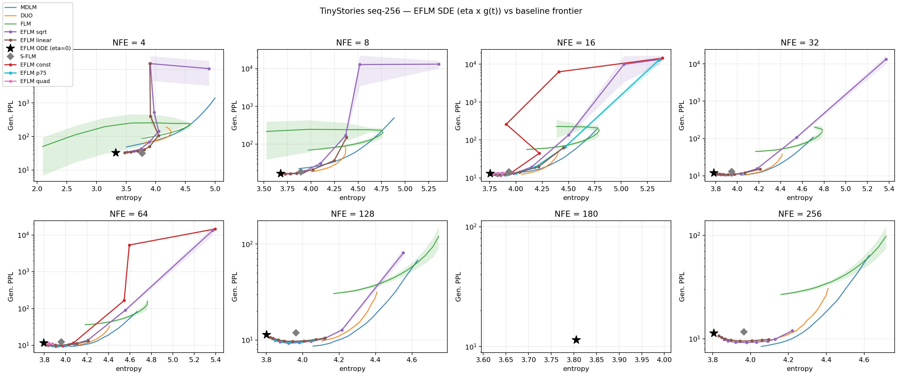

# eflm_sde — Results

Task (`setup.md`): design a `GScheduler` g(t) and find the `eta` range for the
marginal-preserving EFLM SDE sampler (`derivation.md`) such that EFLM traces a
competitive GenPPL-vs-entropy frontier against DUO / MDLM / FLM
(`experiments/naive_ar_tinystories_s256`) and S-FLM.

Protocol: frozen 3-seed checkpoints `eflmratr_lr-1e-3_r-0.5_m-1.0{,_s2,_s3}`
(R=0.5, TAU_MAX=2.4436, 30k steps, TinyStories seq-256); eval = exact
velocity, `top_k_velocity=1`, greedy last, 512 samples/cell, GenPPL =
gpt2-large retokenized, unigram entropy; eval seed fixed. Baseline curves:
per-seed `frontier_cells.csv` of `naive_ar_tinystories_s256` (same 3-seed,
512-sample, per-NFE protocol). S-FLM: `seed_errbar` checkpoints (trunc+ada,
SC), default decode, NFE-swept.

**STATUS: COMPLETE — phases 1-2 + p75 refinement, 461 EFLM cells + 24 S-FLM
cells, 0 failures.**

---

## 1. Headline: the SDE ends the entropy trap, and moderate eta is a free lunch

The ODE sampler (eta=0) has no diversity knob under the recorded protocol
(temperature and the greedy last step are argmax-invariant): it sits at one
point, GenPPL ~11.3-13.1 @ H 3.75-3.81, left of every measured baseline
curve. With g(t) = sqrt(1-t) and moderate eta, EFLM **improves both axes at
once** (3 seeds, mean +- sd):

| NFE | ODE (eta=0) | best SDE cell | delta GenPPL | delta H |
|---|---|---|---|---|
| 16  | 13.06 +- 0.81 @ 3.754 | sqrt eta=2: **11.95 +- 0.26** @ 3.899 | -1.11 | +0.15 |
| 32  | 12.00 +- 0.56 @ 3.783 | sqrt eta=2: **10.48 +- 0.22** @ 3.888 | -1.52 | +0.11 |
| 64  | 11.60 +- 0.50 @ 3.796 | sqrt eta=4: **9.56 +- 0.06** @ 3.927 | -2.04 | +0.13 |
| 128 | 11.41 +- 0.48 @ 3.802 | sqrt eta=4: **9.26 +- 0.12** @ 3.923 | -2.15 | +0.12 |
| 256 | 11.33 +- 0.44 @ 3.806 | sqrt eta=8: **9.21 +- 0.05** @ 3.979 | -2.12 | +0.17 |

For scale: the parent sweep's recommended EFLM operating point was
11.44 +- 0.54 (180 NFE) and best-S-FLM is 11.22 +- 0.47 (180 NFE). The SDE at
**64 NFE** reaches 9.56 +- 0.06 — ~1.9 GenPPL better than both at a third of
the budget, with *higher* entropy. The mechanism is the standard SDE-vs-ODE
effect: the injected noise + score correction contracts accumulated
discretization/model error instead of integrating it.

**The SDE also collapses seed variance.** In the basin, GenPPL sd drops from
0.44-0.81 (ODE) to 0.05-0.26 — up to ~9x. Trajectory noise washes out
seed-specific error, so the frontier is *more* reproducible stochastic than
deterministic.

## 2. Competitiveness at matched entropy

Gen. PPL interpolated along each 3-seed mean curve:

| NFE | H=4.10: MDLM / DUO / FLM / **EFLM** | H=4.20: MDLM / DUO / FLM / **EFLM** |
|---|---|---|
| 8   | 26.98 / 20.54 / 78.63 / **26.50** (lin) | 31.10 / 24.09 / 78.95 / **33.24** (lin) |
| 16  | 14.53 / 13.01 / -    / **16.05** (lin) | 16.52 / 15.28 / 58.25 / **19.23** (lin) |
| 32  | 10.91 / 10.92 / -    / **12.69** (lin) | 12.24 / 12.52 / 45.41 / **14.89** (lin) |
| 64  |  9.63 / 10.14 / -    / **11.11** (lin) | 10.77 / 11.61 / 36.62 / **12.86** (lin) |
| 128 |  8.83 / -     / -    / **10.15** (sqrt)| 10.05 / 11.02 / 30.96 / **12.34** (sqrt)|
| 256 |  8.70 /  9.68 / -    /  **9.59** (sqrt)|  9.73 / 11.05 / 27.43 / **11.50** (sqrt)|

- **vs FLM** (the continuous-flow baseline): EFLM wins by **3-4x at every
  budget and entropy** where FLM is measurable. The Euclidean flow with the
  SDE decode is simply a better continuous-flow generator than FLM here.
- **vs DUO**: EFLM *beats* DUO at NFE 256 / H 4.10 (9.59 vs 9.68) and is
  within 4-10% at NFE >= 32; DUO keeps a real edge only at NFE 8-16.
- **vs MDLM** (the strongest baseline): gap is 10-16% at H 4.10 across
  NFE 16-256, and EFLM *matches* MDLM at NFE 8 (26.50 vs 26.98). MDLM is
  not caught at H >= 4.35, where EFLM's curves bend up 2-3x above it.
- **Below H ~= 4.05** the baselines have no measured points (their T-grid
  floor); EFLM's basin (9.2-9.6 @ H 3.85-4.0) extends the measured Pareto
  frontier into that region at NFE >= 64.

Verdict on the setup.md goal: **EFLM is now on-chart and competitive over
H in [3.8, ~4.2]** — dominating FLM everywhere, trading with DUO, ~10-16%
behind MDLM — instead of being a single point outside the plot. The
H >= 4.35 regime remains MDLM's.

## 3. vs S-FLM: dominated at every NFE >= 8

S-FLM under its recorded decode is T-inert like EFLM, so it contributes one
point per NFE. EFLM's SDE curve passes below it everywhere except NFE 4:

| NFE | S-FLM | EFLM SDE (nearest-entropy cell) | EFLM better by |
|---|---|---|---|
| 4   | 32.00 +- 1.61 @ 3.771 | 36.66 +- 2.17 @ 3.698 (lin eta=1) | -15% (tie/worse) |
| 8   | 18.34 +- 0.64 @ 3.894 | 16.96 +- 0.79 @ 3.848 (lin eta=2) | +8% |
| 16  | 14.50 +- 0.29 @ 3.932 | 11.95 +- 0.26 @ 3.899 (sqrt eta=2) | +18% |
| 32  | 13.04 +- 0.21 @ 3.948 | 10.50 +- 0.13 @ 3.945 (sqrt eta=4) | +19% |
| 64  | 12.27 +- 0.23 @ 3.958 | 9.78 +- 0.09 @ 3.990 (sqrt eta=8) | +20% |
| 128 | 11.88 +- 0.15 @ 3.963 | 9.41 +- 0.13 @ 3.982 (sqrt eta=8) | +21% |
| 256 | 11.67 +- 0.14 @ 3.966 | 9.21 +- 0.05 @ 3.979 (sqrt eta=8) | +21% |

(Caveat: S-FLM is compared at its single decode; an SDE sampler for S-FLM's
spherical geometry — the analogous derivation on the sphere — is the fair
follow-up and plausibly recovers a similar gain.)

## 4. GScheduler design: what the power family taught us

g(t) = (1-t)^p, i.e. diffusion a(b) = eta b^{2p} in the noise fraction b:

- **const (p=0) — rejected.** Full-strength injection at the decode endpoint
  destroys decodability: catastrophic collapse from eta ~= 2-4 (GenPPL in the
  thousands at H -> 5.37 ~= noise). Consistent with the parent sweep's
  endpoint noise:signal invariant (§4.5 there): const is the only schedule
  whose endpoint injection does not vanish.
- **quad (p=2) — rejected.** Early-only injection is re-absorbed by the
  remaining denoising steps; entropy barely moves (max +0.14 at eta=32) —
  it converges back to the ODE answer, as the marginal-preserving theory
  predicts for the fine-step limit.
- **sqrt (p=0.5) — the workhorse.** Optimal at NFE >= 32 for H <= ~4.2 and
  holds the free-lunch basin (§1). This is exactly the "regular family"
  a(b) = 2 lambda b of derivation.md §9.
- **linear (p=1) — the safe all-rounder.** Optimal at NFE 8-16, best above
  H ~= 4.2 at NFE <= 64, and degrades gracefully: within the swept grid it
  never explodes catastrophically at NFE >= 16 (worst in-grid cell 62.5 @
  H 4.45), while sqrt blows past ~2x its basin eta.
- The optimal p **falls as NFE grows** (linear at 8-16 -> sqrt at >= 32):
  with more steps, earlier-weighted noise is safely re-absorbed, so pushing
  injection later (smaller p) buys entropy more cheaply.
- **p75 (p=0.75) — interpolates, does not dominate.** In the crossover band
  (NFE 16-128, H <= 4.2) sqrt / p75 / linear are within ~5% of one another
  (mostly ~2 sd): at NFE 64 / H 4.10 they give 11.21 / 11.10 / 11.11; in the
  NFE-128 basin sqrt still leads (9.26 vs p75 9.47 vs linear 9.74); at
  NFE 16 / H 4.20 linear still leads (19.23 vs p75 22.12 vs sqrt 36.00).
  Its collapse boundary also sits between the two. Conclusion: **the
  frontier is insensitive to p in [0.5, 1] in the crossover band** — the p
  choice only matters at the extremes, so two named schedules (sqrt, linear)
  cover the design space and no intermediate scheduler is needed.

**Stability boundary.** For each g, catastrophic blowup sets in when the
per-step injection outruns what the remaining steps can denoise; empirically
eta* ~= 2 NFE for sqrt (8 @ NFE 4 ... 128 @ NFE 64) and >= 8 NFE for linear.
Near the boundary the failure is bimodal with enormous seed variance
(NFE 4, sqrt eta 16: 14956 +- 10316) — the same cliff-edge behavior as the
parent sweep's §4.1. Recommended operating etas sit >= 4x below eta*.

**Recommended defaults** (`sampler.eta`, `sampler.gt_method`):

| budget | recommendation |
|---|---|
| NFE <= 16 | `linear`, eta ~= NFE/8 (entropy target permitting) |
| NFE >= 32, H <= 4.2 | `sqrt`, eta ~= NFE/16 (free-lunch basin) |
| NFE >= 32, H > 4.2 | `sqrt` with eta up to ~NFE/4, or `linear` at 2-4x that eta |

## 5. Limitations / open items

1. **NFE = 4 is not rescued.** The SDE cannot fix a 4-step trajectory
   (best 33-37 vs MDLM 49-86 at its own entropy... actually EFLM at NFE 4 is
   *better* than MDLM's NFE-4 curve at matched low entropy, but both are far
   off the usable frontier). NFE = 1 is a single decode step; eta never acts.
2. **H >= 4.35 is not competitive** (2-3x behind MDLM). Buying that much
   entropy with white noise costs too much GenPPL; a temperature-sensitive
   decode (top_k_velocity > 1 or ancestral last step) composed with the SDE
   is the untested lever.
3. **Baselines have no measured points below H ~= 4.05** (their T-grid
   floor, naive_ar limitation #1), so "EFLM extends the frontier leftward"
   is unverified against T < 0.5 baselines.
4. **S-FLM is a per-NFE point, not a curve** (T-inert decode); a spherical
   SDE sampler would make that a fair curve-vs-curve comparison.
5. Data-entropy anchor for the x-axis still missing (naive_ar limitation #2).

## Reproduce

    python experiments/eflm_sde/frontier_sweep.py                   # pilot
    python experiments/eflm_sde/frontier_sweep.py --seeds 1 2 3 --nfes 4 8 \
        --gts sqrt linear --etas 0.25 0.5 1 2 4 8 16 32
    python experiments/eflm_sde/frontier_sweep.py --seeds 1 2 3 --nfes 16 32 \
        --gts sqrt linear --etas 0.5 1 2 4 8 16 32 64 --ode-extra
    python experiments/eflm_sde/frontier_sweep.py --seeds 1 2 3 --nfes 64 128 256 \
        --gts sqrt linear --etas 1 2 4 8 16 32 64 128 --ode-extra
    python experiments/eflm_sde/frontier_sweep.py --seeds 1 2 3 --nfes 16 64 128 \
        --gts p75 --etas 1 2 4 8 16 32 64 --ode-extra
    python experiments/eflm_sde/frontier_sweep.py --sfm --seeds 1 2 3 \
        --nfes 1 4 8 16 32 64 128 256
    python experiments/eflm_sde/analyze.py
