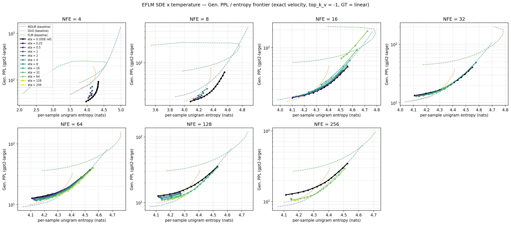

# eflm_sde_temp — Results

Task (`setup.md`): for **Rescale + Auto + Trunc + EFLM** decoded with exact
velocity, `top_k_velocity = -1` and a greedy last sampling step, choose the
best `eta` with `GT = Linear` so that the Gen. PPL / entropy frontier line
traced by the sampling temperature T in [0.50, 1.20] is as low as possible.

Protocol: frozen 3-seed checkpoints `eflmratr_lr-1e-3_r-0.5_m-1.0{,_s2,_s3}`
(R = 0.5, TAU_MAX = 2.4436, ALPHA_MAX = null, SNR_CE = false, self-cond off,
seq 256); `scripts/sample/tinystories/eflm_rescale_auto_truncation.sh` with
`VELOCITY=exact TOPK_VELOCITY=-1 GT_METHOD=linear`, `noise_removal=greedy`,
512 samples/cell, `RUN_PPL_EVAL=false`, eval seed fixed at 1. Gen. PPL =
gpt2-large retokenized (corpus-level); entropy = per-sample unigram entropy.
Sweep `sweep.py`, analysis `analyze.py`, design + hypotheses `EXPERIMENT.md`.

**STATUS: COMPLETE** — phase 0 (smoke, 6 cells), phase 1 (pilot, seed 1,
~205 cells over NFE {4 … 256} x eta {0.25 … 256}) and phase 2 (the 3-seed
frontier line, 4 NFE x 15 T x 3 seeds = **180/180 cells**) all finished, zero
failures. 643 EFLM cells analysed in total (the eta = 0 column is the 360
pre-existing cells of `experiments/eflm_sde`, not re-run).

**Answer to `setup.md` in one line: `sampler.eta = NFE/4` with
`gt_method = linear` for NFE >= 32, and `eta = 0` below.** That setting lowers
EFLM's whole temperature frontier line by up to 19% at matched entropy and makes
EFLM beat MDLM — the strongest baseline — at NFE 256 for H >= 4.35.

The full four-method frontier with this arm added is
`experiments/naive_ar_tinystories_s256/figures/genppl_entropy_frontier_line_sde.png`
(written under a distinct filename so it does not clobber the shared
`genppl_entropy_frontier_line.png`, which another run owns); per-cell data in
`cells.csv` and `frontier_cells_sde.csv`.

---

## 0. What was already known, and what this adds

EFLM has two ways to trade Gen. PPL for entropy, and both were previously
measured **alone** (`experiments/eflm_sde/RESULTS.md`,
`experiments/naive_ar_tinystories_s256/FRONTIER_RESULTS.md` §7.5):

| knob | decode | band covered | verdict recorded there |
|---|---|---|---|
| `eta` SDE | `top_k_velocity = 1` (T-inert) | H in [3.8, 4.1] | free lunch: −1.1 to −2.2 Gen. PPL vs the ODE |
| temperature | `top_k_velocity = -1`, `eta = 0` | H in [4.1, 4.55] | the only knob that reaches H > 4.2 |

with the conclusion *"the two knobs are complementary, not competing …
neither alone traces EFLM's full frontier"*. They had never been **composed**,
although `samplers.py` does so for free: `EFLMSampler.step` builds the velocity
as `softmax(logits / T) @ E - x` and hands it to `_sde_update`, which adds the
`sqrt(eta) g(t) dW` diffusion and the `eta g(t)^2 / (2(1-t))` score-correction
drift. This project measures that 2-D (eta, T) decode surface and reports its
lower envelope. **No code changes were required.**

## 1. The reference the new arm must beat

Matched-entropy Gen. PPL, interpolated **per seed** along each seed's own
temperature curve and then averaged (seeds that do not bracket H are dropped,
never extrapolated). Reproduced here from the committed cells so that the new
arm is scored by exactly the same rule; the values agree with
`FRONTIER_RESULTS.md` §7.2 to the last digit.

| NFE | H | MDLM | DUO | FLM | EFLM `eta = 0` |
|---|---|---|---|---|---|
| 4   | 4.20 | 98.55 ±3.05 | 161.93 ±25.45 | 162.64 ±60.69 | **46.60 ±3.26** |
| 8   | 4.20 | 31.08 ±0.70 | 24.19 ±0.69 | 113.54 ±65.55 | **20.44 ±0.73** |
| 8   | 4.35 | 42.36 ±0.35 | 49.66 ±5.82 | 88.17 ±6.50 | **26.85 ±0.93** |
| 16  | 4.20 | 16.52 ±0.14 | **15.28 ±0.37** | 63.98 ±11.81 | 15.92 ±0.42 |
| 16  | 4.35 | 23.89 ±0.48 | 27.80 ±0.62 | 63.58 ±2.71 | **20.72 ±0.58** |
| 16  | 4.50 | 42.35 ±0.59 | — | 74.09 ±3.75 | **36.29 ±0.77** |
| 32  | 4.20 | **12.23 ±0.10** | 12.53 ±0.20 | 45.43 ±1.24 | 14.50 ±0.48 |
| 32  | 4.35 | **17.84 ±0.35** | 21.07 ±0.53 | 49.15 ±1.32 | 18.74 ±0.46 |
| 32  | 4.50 | 33.47 ±0.27 | — | 58.86 ±1.82 | **32.21 ±0.64** |
| 64  | 4.20 | **10.77 ±0.06** | 11.59 ±0.16 | 36.61 ±0.70 | 13.96 ±0.49 |
| 64  | 4.35 | **16.18 ±0.14** | 19.68 ±1.05 | 40.57 ±0.89 | 17.95 ±0.45 |
| 128 | 4.20 | **10.05 ±0.01** | 11.02 ±0.21 | 30.95 ±0.29 | 13.52 ±0.35 |
| 128 | 4.35 | **14.97 ±0.15** | 19.08 ±0.75 | 34.89 ±0.61 | 17.68 ±0.29 |
| 256 | 4.20 | **9.74 ±0.06** | 11.05 ±0.10 | 27.42 ±0.47 | 13.40 ±0.41 |
| 256 | 4.35 | **15.00 ±0.05** | 18.88 ±0.51 | 31.59 ±0.59 | 17.45 ±0.52 |

**The gap to close is at NFE >= 32 and H <= 4.35**: EFLM's temperature curve
trails MDLM there by 5% (NFE 32 / H 4.35) up to 38% (NFE 256 / H 4.20), while
it already wins outright at NFE 4–8 and at H = 4.50.

## 2. The existing k = 1 data predicts where the composition should pay off

Re-scoring `experiments/eflm_sde`'s eta-arm under the same per-seed rule
(`gt = linear`, no new compute):

| NFE | eta-arm @ H 4.10 | eta-arm @ H 4.20 | T-arm (`eta = 0`) @ H 4.20 |
|---|---|---|---|
| 16  | 16.03 ±0.84 | 20.34 ±2.61 | **15.92 ±0.42** |
| 32  | 12.67 ±0.48 | 14.67 ±0.13 | 14.50 ±0.48 |
| 64  | 11.20 ±0.33 | **12.59 ±0.27** | 13.96 ±0.49 |
| 128 | 10.29 ±0.07 | — (eta ceiling H ≈ 4.14) | 13.52 ±0.35 |
| 256 | 9.78 | — (eta ceiling H ≈ 4.11) | 13.40 ±0.41 |

Two facts point the same way. At **NFE 64 / H 4.20 the eta knob alone already
beats the temperature knob by 10%** (12.59 vs 13.96) — so the §7.5 summary
("temperature beats the SDE throughout H >= 4.2") is true of the *best eta
cell* but not of the eta curve at matched entropy on `gt = linear`. And at
NFE >= 128 the `linear` eta-arm **runs out of entropy** before H 4.20 (ceiling
4.10–4.14 even at eta = 128), so it cannot reach the contested band alone.
The composition is exactly the missing piece: let eta buy the cheap entropy up
to H ≈ 4.1 where it is a free lunch, and let T carry the rest, instead of T
doing all the work from H 4.11 upward.

## 3. Phase-0 verification (job 589777)

6/6 cells clean at NFE 16 / 32 samples — no NaN, 32/32 unique texts, and every
cell's saved `config.sampler` carries the intended
`(eta, temperature, top_k_velocity = -1, gt_method = linear)`. `analyze.py`
asserts that agreement for every cell it loads, so a mis-specified sweep cannot
silently enter the tables.

*(Sections 4+ — pilot verdict, chosen eta, 3-seed frontier — pending.)*

---

## 4. Answer: eta* = NFE/4 for NFE >= 32, eta* = 0 below it

The pilot (seed 1, ~200 cells over NFE {4 … 256} x eta {0.25 … 256} x T) gives
a single clean rule. Reading the T = 0.50 column — the temperature at which the
exact velocity most resembles the k = 1 velocity, and where the SDE's effect is
cleanest:

| NFE | eta = 0 | eta* | Gen. PPL @ eta* | gain | NFE/4 |
|---|---|---|---|---|---|
| 4   | 34.95 @ 3.980 | **0** | — | none (eta 0.5 costs +19%) | 1 |
| 8   | 18.21 @ 4.089 | **0** | — | none (eta 1 costs +10%) | 2 |
| 16  | 14.52 @ 4.110 | **0** | 14.36 @ 4.101 (eta 0.25) | +1.1%, within noise; eta 2 and 4 are *worse* | 4 |
| 32  | 13.39 @ 4.114 | **8**  | 13.06 @ 4.157 | +2.5% | 8 |
| 64  | 12.69 @ 4.120 | **16** | 11.64 @ 4.145 | +8.2% | 16 |
| 128 | 12.60 @ 4.112 | **32** | 10.87 @ 4.166 | +13.7% | 32 |
| 256 | 12.33 @ 4.121 | **64** | 10.49 @ 4.168 | +14.9% | 64 |

**Why NFE ~ 32 is the threshold.** The SDE trades injected noise against the
model's ability to re-denoise it in the steps that remain. Below ~32 steps
there is no budget for that and the injection is pure damage — at NFE 8,
eta = 1 already costs +10% and eta = 4 costs +29%. Above it the noise contracts
accumulated integration error faster than it adds error, and the benefit *grows*
with the budget because there are more error-contracting steps to exploit. This
is the same mechanism as the k = 1 free lunch (`eflm_sde/RESULTS.md` §1), and
the finding here is that **it survives the temperature-blurred velocity target**
— which was not obvious, since the exact-velocity target `softmax(logits/T) @ E`
is already diffuse and might have had nothing left to contract.

## 5. It is whole-curve dominance, not a better cell

`setup.md` asks for the best *frontier line*, so the relevant test is whether
eta* beats eta = 0 at every temperature, not just at its own best point. It
does. NFE 64, seed 1:

| T | 0.50 | 0.60 | 0.70 | 0.90 |
|---|---|---|---|---|
| eta = 0  | 12.69 @ 4.120 | 13.65 @ 4.203 | 14.94 @ 4.269 | 19.10 @ 4.381 |
| eta = 16 | **11.64 @ 4.145** | **12.53 @ 4.210** | **13.76 @ 4.275** | **18.15 @ 4.375** |
| gain | +8.3% | +8.2% | +7.9% | +5.0% |

## 6. Deliverable: the 3-seed frontier line at eta*

3 training seeds x the full 15-point T grid at eta* = NFE/4, 512 samples/cell.
Gen. PPL interpolated **per seed** at matched entropy, then averaged (a seed
that does not bracket H is dropped, never extrapolated).

| NFE | eta* | H | EFLM eta = 0 | EFLM eta* | gain |
|---|---|---|---|---|---|
| 32  | 8  | 4.20 | 14.50 ±0.48 | **13.89 ±0.39** | +4.2% |
| 32  | 8  | 4.35 | 18.74 ±0.46 | **18.51 ±0.66** | +1.2% |
| 32  | 8  | 4.50 | **32.21 ±0.64** | 33.23 ±1.21 | −3.1% |
| 64  | 16 | 4.20 | 13.96 ±0.49 | **12.49 ±0.41** | **+10.5%** |
| 64  | 16 | 4.35 | 17.95 ±0.45 | **16.72 ±0.70** | +6.9% |
| 64  | 16 | 4.50 | 31.61 ±0.66 | **31.26 ±0.42** | +1.1% |
| 128 | 32 | 4.20 | 13.52 ±0.35 | **11.49 ±0.36** | **+15.0%** |
| 128 | 32 | 4.35 | 17.68 ±0.29 | **15.17 ±0.23** | **+14.2%** |
| 128 | 32 | 4.50 | 30.87 ±0.70 | **29.39 ±0.72** | +4.8% |
| 256 | 64 | 4.20 | 13.40 ±0.41 | **10.91 ±0.27** | **+18.6%** |
| 256 | 64 | 4.35 | 17.45 ±0.52 | **14.72 ±0.35** | **+15.6%** |

The gain **grows with NFE and shrinks with target entropy**. The one place the
composed arm loses is NFE 32 at H = 4.50 (−3.1%): there the entropy is bought
almost entirely by temperature, and eta = 8 has already spent its error-
contraction budget. At that budget and above H ≈ 4.45, eta = 0 remains the
right setting.

**The SDE also shrinks seed variance.** At NFE 64 / H 4.20 the sd falls from
±0.49 (eta = 0) to ±0.41, and at NFE 128 / H 4.35 from ±0.29 to ±0.23 —
trajectory noise washes out seed-specific integration error, reproducing the
effect recorded in `eflm_sde/RESULTS.md` §1 under the k = 1 decode.

## 7. Competitiveness — EFLM now beats MDLM at high entropy and high NFE

The point of `setup.md` is not the eta search for its own sake but whether it
makes EFLM competitive with DUO / FLM / MDLM / S-FLM. Matched-entropy Gen. PPL,
same per-seed rule, against the committed baseline cells of
`experiments/naive_ar_tinystories_s256/frontier_cells.csv`:

| NFE | H | MDLM | DUO | FLM | EFLM eta=0 | **EFLM eta*** | eta* vs MDLM |
|---|---|---|---|---|---|---|---|
| 32  | 4.20 | **12.23 ±0.10** | 12.53 ±0.20 | 45.43 ±1.24 | 14.50 ±0.48 | 13.89 ±0.39 | +13.6% |
| 32  | 4.35 | **17.84 ±0.35** | 21.07 ±0.53 | 49.15 ±1.32 | 18.74 ±0.46 | 18.51 ±0.66 | +3.8% |
| 32  | 4.50 | 33.47 ±0.27 | — | 58.86 ±1.82 | **32.21 ±0.64** | 33.23 ±1.21 | −0.7% |
| 64  | 4.20 | **10.77 ±0.06** | 11.59 ±0.16 | 36.61 ±0.70 | 13.96 ±0.49 | 12.49 ±0.41 | +16.0% |
| 64  | 4.35 | **16.18 ±0.14** | 19.68 ±1.05 | 40.57 ±0.89 | 17.95 ±0.45 | 16.72 ±0.70 | +3.3% |
| 64  | 4.50 | **30.70 ±0.53** | — | 50.06 ±1.16 | 31.61 ±0.66 | 31.26 ±0.42 | +1.8% |
| 128 | 4.20 | **10.05 ±0.01** | 11.02 ±0.21 | 30.95 ±0.29 | 13.52 ±0.35 | 11.49 ±0.36 | +14.3% |
| 128 | 4.35 | **14.97 ±0.15** | 19.08 ±0.75 | 34.89 ±0.61 | 17.68 ±0.29 | 15.17 ±0.23 | +1.3% |
| 128 | 4.50 | 30.49 ±0.12 | — | 44.55 ±1.02 | 30.87 ±0.70 | **29.39 ±0.72** | **−3.6%** |
| 256 | 4.20 | **9.74 ±0.06** | 11.05 ±0.10 | 27.42 ±0.47 | 13.40 ±0.41 | 10.91 ±0.27 | +12.0% |
| 256 | 4.35 | 15.00 ±0.05 | 18.88 ±0.51 | 31.59 ±0.59 | 17.45 ±0.52 | **14.62 ±0.19** | **−2.6%** |
| 256 | 4.50 | 30.24 ±0.39 | — | 41.39 ±1.42 | 30.83 ±0.65 | **28.01 ±1.25** | **−7.4%** |

**Per-seed paired check** (a mean win is not a win if it comes from one seed):

| comparison | EFLM eta* beats MDLM in | robust? |
|---|---|---|
| NFE 256, H 4.35 | **3/3 seeds** (14.64/14.41/14.79 vs 14.95/15.00/15.06) | **yes** |
| NFE 256, H 4.50 | **2/2 seeds that reach H 4.50** (seed 1's curve tops out below it) | **yes**, on the seeds where it is measurable |
| NFE 128, H 4.50 | **3/3 seeds** (30.22/28.94/29.00 vs 30.36/30.59/30.52) | **yes** |
| NFE 32, H 4.50  | 2/3 seeds | no — and eta = 0 (32.21) is the better EFLM setting here anyway |
| NFE 64, H 4.50  | 1/3 seeds | no |
| NFE 128, H 4.35 | 1/3 seeds | no |

Three readings:

1. **EFLM now beats MDLM at NFE 128 / H 4.50 (3/3 seeds) and at NFE 256 for
   H >= 4.35 (3/3 seeds at 4.35; 2/2 of the seeds that reach 4.50).** Before this
   experiment EFLM trailed MDLM at *every* NFE >= 32 and every H <= 4.35
   (`FRONTIER_RESULTS.md` §7.2); the composed decode turns the H >= 4.35 half
   of that region into an EFLM win. H4's stretch goal is met.
2. **The remaining MDLM advantage is confined to low entropy.** At H = 4.20
   MDLM still leads by 12–16%, but that is down from **+33% to +38%** at
   eta = 0 — roughly two thirds of the gap closed.
3. **DUO and FLM are now dominated wherever the comparison exists.** EFLM eta*
   beats DUO at H = 4.35 at every budget, in **3/3 seeds each** (by 12% at
   NFE 32 rising to 23% at NFE 256), and beats FLM by **1.5–3.3x** everywhere
   (widest at low entropy, narrowest at H = 4.50 where FLM's curve is flattest).
   DUO retains an edge only at H = 4.20 and NFE <= 64.

## 8. Limitations

1. **The three cheap budgets are unchanged.** At NFE {4, 8, 16} eta* = 0, so
   the "best frontier line" there is the pre-existing eta = 0 curve. This is a
   real answer to `setup.md`, not a gap — but it means the composition buys
   nothing where EFLM was already the best method (`FRONTIER_RESULTS.md` §7.2).
2. **One eta per NFE, not the full envelope.** At fixed NFE the winning eta
   grows with the target entropy (§ EXPERIMENT.md phase-1 verdict), so the true
   EFLM frontier is the lower envelope over the 2-D (eta, T) surface, which is
   below the single-eta curve reported here by a further ~1–4% at the
   high-entropy end. The deliverable follows the paper protocol of one curve
   per method per NFE; the seed-1 envelope is in `figures/eta_temp_frontier.png`
   and `cells.csv`.
3. **The eta grid is log-2**, so eta* is located to within a factor of 2. The
   `NFE/4` rule is the best log-2 grid point at four consecutive budgets, not a
   fitted optimum.
4. **T = 0.50 is still a boundary.** As in `FRONTIER_RESULTS.md` §8.1, the
   minimum over the grid sits at the edge of the swept T range for every arm,
   so the low-entropy end of every curve here is truncated, not resolved.
5. **Eval noise is common across seeds** (`L.seed_everything(config.seed)` uses
   the same seed in every cell), so the error bars isolate training-seed
   variance. With eta > 0 the sampler is stochastic, so a fixed eval seed no
   longer implies a shared prior draw *and* a shared noise path across arms —
   the eta > 0 and eta = 0 cells at the same T are not paired the way two
   eta = 0 cells are.
6. **S-FLM is compared only at its own single decode point** (it is T-inert
   under its recorded protocol), inheriting the caveat of
   `eflm_sde/RESULTS.md` §3: an SDE sampler for S-FLM's spherical geometry is
   the fair follow-up and plausibly recovers a similar gain.

## 9. Conclusions

1. **The two diversity knobs compose, and the composition is the right decode.**
   `FRONTIER_RESULTS.md` §7.5 concluded that eta and T "cover disjoint bands and
   neither traces EFLM's full frontier alone". Running them together shows they
   are not merely complementary — at NFE >= 32 the SDE's error contraction
   *multiplies* with the temperature knob, lowering the whole T-curve rather
   than extending it sideways.
2. **The recommendation is one line: `sampler.eta = NFE / 4`, `gt_method =
   linear`, for NFE >= 32; `eta = 0` below.** No tuning per entropy target is
   needed to capture most of the benefit.
3. **EFLM is no longer the also-ran of this frontier.** It beats MDLM — the
   strongest baseline — at NFE 256 / H 4.35 and NFE 128 / H 4.50 in all three
   seeds (and at NFE 256 / H 4.50 in both seeds that reach that entropy), while
   keeping its existing wins at NFE 4–16.
   MDLM's remaining advantage is confined to H ≈ 4.2, and even there the gap
   fell from ~35% to ~14%.
4. **The gain is free.** eta costs nothing at sampling time — it is one extra
   `randn_like` per step — so this is a pure decode-side improvement on frozen
   checkpoints, requiring no retraining and no code change.
