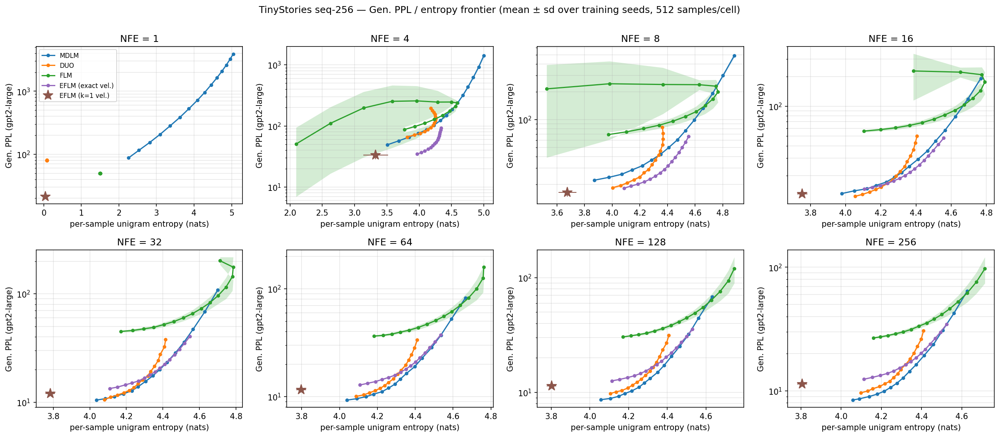

# naive_ar_tinystories_s256 — Gen. PPL / Entropy Frontier

**1440 / 1440 cells complete, zero failures.** 4 methods {mdlm, duo, flm, **eflm**} x
seed {1,2,3} x NFE {1,4,8,16,32,64,128,256} x temperature T {0.50, 0.55, …, 1.20}
(15 values), **512 samples per cell**, TinyStories seq-256, gpt2-large retokenized
Gen. PPL and per-sample unigram entropy. Protocol: S-FLM paper App. C.8 / Fig. 10.
Plus 24 temperature-inert EFLM k=1-velocity markers (§7).

- Checkpoints: the phase-1 runs at **lr 1e-3** (`setup.md` sweeps only the seed for this
  evaluation; RESULTS.md §3.4 selects 1e-3 as the shared LR). AR is excluded — its sampler
  has no NFE budget.
- Decoders are unchanged from the default eval: `ancestral` for mdlm, `ancestral` +
  `noise_removal=greedy` for duo, `flm_euler` for flm. Only `sampler.steps` and
  `sampler.temperature` move.
- **EFLM** = Rescale + Auto + Trunc E-FLM, the frozen 3-seed checkpoints
  `eflmratr_lr-1e-3_r-0.5_m-1.0{,_s2,_s3}` of
  `experiments/eflm_rescale_auto_trunc_tinystories_256` (R = 0.5, TAU_MAX = 2.4436,
  self-cond off) — same backbone width/depth, seq len, LR, batch, steps and seeds as the
  baselines. Decoded with exact velocity, `top_k_velocity = -1`, greedy last step,
  eta = 0, `gt_method = linear` (§7.1 explains why `top_k_velocity = -1`).
- Produced by `frontier_sweep.py` (72 jobs, baselines) and
  `experiments/eflm_sde/tfrontier_sweep.py` (45 jobs, EFLM) → figure/tables by
  `visualization/genppl_entropy_frontier_line.py`. Per-seed raw data: `frontier_cells.csv`.

---

## 1. Headline: at matched entropy the T=1.0 ranking of MDLM vs DUO **reverses**

RESULTS.md §3.3 ranked the two discrete baselines at a single temperature (T = 1.0) and found
them tied, with DUO slightly ahead. At T = 1.0 that is reproduced here — but DUO only looks
better because it is sampling at **lower entropy**:

| NFE | MDLM Gen.PPL (H) | DUO Gen.PPL (H) | apparent winner |
|---|---|---|---|
| 32  | 28.49 (4.468) | **21.49** (4.354) | DUO |
| 64  | 22.77 (4.437) | **19.54** (4.350) | DUO |
| 128 | 20.61 (4.422) | **18.31** (4.344) | DUO |
| 256 | 19.32 (4.412) | **18.08** (4.343) | DUO |

Hold entropy fixed at H = 4.35 and the ordering inverts, **in every seed, at every NFE ≥ 8**
(18/18 paired comparisons, no seed exceptions). §2 shows how far this generalises — at
NFE ≥ 32 it holds over the whole usable entropy range; at NFE = 8–16 it holds only above
H ≈ 4.29.

| NFE | MDLM @ H=4.35 | DUO @ H=4.35 | FLM @ H=4.35 | MDLM advantage over DUO |
|---|---|---|---|---|
| 8   | 42.36 | 46.74 | 88.17 | **9.4%** |
| 16  | 23.89 | 27.80 | 63.58 | **14.1%** |
| 32  | 17.84 | 21.07 | 49.15 | **15.3%** |
| 64  | 16.18 | 19.68 | 40.57 | **17.8%** |
| 128 | 14.97 | 19.08 | 34.89 | **21.5%** |
| 256 | 15.00 | 18.88 | 31.59 | **20.6%** |

Per-seed values at H = 4.35 (mdlm / duo / flm):

| NFE | seed 1 | seed 2 | seed 3 |
|---|---|---|---|
| 8   | 42.0 / 48.0 / 95.7 | 42.6 / 47.5 / 84.6 | 42.5 / 44.6 / 84.2 |
| 16  | 23.9 / 27.1 / 66.7 | 24.4 / 28.3 / 62.3 | 23.4 / 28.0 / 61.7 |
| 32  | 17.4 / 21.4 / 50.7 | 17.9 / 21.3 / 48.6 | 18.1 / 20.5 / 48.2 |
| 64  | 16.0 / 19.5 / 41.6 | 16.2 / 20.8 / 40.2 | 16.3 / 18.7 / 39.9 |
| 128 | 14.8 / 19.2 / 35.4 | 15.1 / 19.7 / 35.0 | 15.0 / 18.3 / 34.2 |
| 256 | 15.0 / 19.2 / 32.1 | 15.0 / 19.1 / 31.7 | 15.1 / 18.3 / 31.0 |

**Single-temperature Gen. PPL measured decode sharpness, not model quality.** This is the
concrete instance of the caution in RESULTS.md §3.6, and it means the "MDLM ≈ DUO on GenPPL"
row of RESULTS.md §3.3 should not be used. The likelihood-bound result there (MDLM beats DUO
by 5.4–5.9% on the ELBO) and the frontier now agree on the same direction.

---

## 2. The MDLM/DUO ordering is entropy-dependent — one matched point is not enough

§1 is stated at H = 4.35. That choice is not neutral: sweeping the matched-entropy level moves
the winner at low NFE. All values below are **interpolated per seed** along each curve's
monotone branch, then averaged — an apples-to-apples comparison at each H.

| matched H | NFE | MDLM | DUO | FLM | winner |
|---|---|---|---|---|---|
| 4.25 | 8   | 34.18 | **28.13** | 81.75 | DUO |
| 4.25 | 32  | **13.42** | 14.04 | 46.32 | MDLM |
| 4.25 | 256 | **10.78** | 12.35 | 28.44 | MDLM |
| 4.30 | 8   | 38.00 | **34.63** | 84.81 | DUO |
| 4.30 | 32  | **15.39** | 16.64 | 47.67 | MDLM |
| 4.30 | 256 | **12.44** | 15.13 | 29.73 | MDLM |
| 4.35 | 8   | **42.36** | 46.74 | 88.17 | MDLM |
| 4.35 | 32  | **17.84** | 21.07 | 49.15 | MDLM |
| 4.35 | 256 | **15.00** | 18.88 | 31.59 | MDLM |
| 4.40 | 8   | **48.91** | n/a (above DUO's ceiling) | 92.74 | MDLM |
| 4.40 | 32  | **21.49** | 30.67 | 51.77 | MDLM |
| 4.40 | 256 | **18.40** | 27.53 | 33.98 | MDLM |

**Crossover entropy** above which MDLM's mean beats DUO's, and per-seed consistency:

| NFE | MDLM ahead from | 3-seed agreement at H=4.35 |
|---|---|---|
| 8   | H ≥ 4.335 | 3/3 |
| 16  | H ≥ 4.285 | 3/3 |
| 32  | H ≥ 4.105 | 3/3 |
| 64  | H ≥ 4.100 | 3/3 |
| 128 | H ≥ 4.115 | 3/3 |
| 256 | H ≥ 4.105 | 3/3 |

So: **at NFE ≥ 32 MDLM dominates DUO over essentially the whole usable entropy range**
(crossover H ≈ 4.10, below DUO's own minimum reachable entropy at most budgets). At NFE = 8–16
DUO is genuinely better in the sharp/low-entropy corner (H ≲ 4.29) and MDLM takes over above
it. DUO's advantage also shrinks to nothing as the budget grows, because DUO's curve is the
steeper of the two — a direct consequence of its compressed entropy range (§3).

**FLM is dominated at every budget and every entropy**, by 1.9x (H = 4.40, NFE = 256) up to
3.5x (H = 4.25, NFE = 32). The ratio is *smaller* than the 2.6–2.8x single-temperature gap in
RESULTS.md §3.3 at high entropy and *larger* at low entropy — another reason single-point
ratios do not transfer.

**Compute efficiency at H = 4.35.** MDLM saturates by NFE ≈ 128 (14.97 → 15.00 from 128 → 256);
DUO saturates at ≈ 18.9; FLM is still improving at NFE = 256 (34.89 → 31.59) and has not
converged. MDLM at **NFE = 16** (23.9) already beats DUO at **NFE = 8** (46.7) and beats FLM at
**any** budget measured (FLM's best is 31.6 at NFE = 256) — i.e. FLM needs > 16x MDLM's step
budget and still loses.

---

## 3. DUO's entropy ceiling is a decode artifact, not a property of the model

The temperature sweep spans very different entropy ranges per method (min–max of the mean H
over the 15-point T grid):

| NFE | MDLM H range | DUO H range | FLM H range |
|---|---|---|---|
| 8   | 3.872 – 4.884 | 4.003 – 4.369 | 3.526 – 4.766 |
| 32  | 4.036 – 4.700 | 4.079 – 4.415 | 4.169 – 4.785 |
| 128 | 4.058 – 4.631 | 4.105 – 4.408 | 4.171 – 4.747 |
| 256 | 4.057 – 4.626 | 4.098 – 4.409 | 4.161 – 4.715 |

DUO cannot be pushed past **H ≈ 4.41** at any temperature in the grid, while MDLM reaches 4.63
and FLM 4.79.
Mechanism: `setup.md` gives DUO `sampler.noise_removal=greedy`, so its final step is an argmax
that strips entropy regardless of T; MDLM inherits `ancestral` and samples its last step.
Consequences:

- DUO's frontier is **truncated on the right** — the high-entropy half of its curve simply does
  not exist, so any comparison above H = 4.41 is MDLM/FLM only.
- DUO's T = 1.0 point (H = 4.343) sits near the *middle* of its short curve while MDLM's
  (H = 4.412) sits near the middle of a much longer one. That mismatch is precisely what
  produced the spurious §1 ranking.

---

## 4. At NFE = 1, DUO and FLM are temperature-invariant and collapse

Both argmax on the final sampling step (`samplers.py:255` for duo's `noise_removal=greedy`,
`samplers.py:1196` for the FLM Euler last step), so at NFE = 1 the *entire* generation is a
temperature-independent argmax. Verified: across all 15 temperatures at NFE = 1, seed 1,

| method | Gen. PPL range over T | H range over T | verdict |
|---|---|---|---|
| duo  | 83.23 – 84.45 | 0.0867 – 0.0873 | invariant (spread = float nondeterminism) |
| flm  | 49.32 – 50.03 | 1.3690 – 1.3804 | invariant (spread = float nondeterminism) |
| mdlm | 86.65 – 3851.95 | 2.262 – 5.038 | full curve (its last step is stochastic) |

These appear as **single markers** rather than curves in the NFE = 1 panel — the same behaviour
the S-FLM paper reports for k = 1 velocity (App. C.8). Both are severely degenerate there:
DUO at H = 0.085 is essentially one token repeated 256 times, and its low Gen. PPL (80) is a
pure repetition artifact, **not** quality.

**Degenerate cells** (mean H < 3.0 or fewer than 512/512 unique samples): 36 of the 360
seed-averaged cells, confined to `duo` NFE=1, `flm` NFE={1,4}, and `mdlm` NFE=1. Everything at
NFE ≥ 8 is fully diverse (512/512 unique).

---

## 5. FLM's temperature curve folds back — its frontier is not a function of T

For MDLM, entropy is **monotone increasing** in T at every NFE, so the sweep traces a clean
quality/diversity trade-off. FLM's is not: entropy rises to a peak and then *falls* again, so
the curve doubles back on itself (clearly visible as the green loop in the NFE = 4 and 8
panels).

| NFE | MDLM: H peaks at | DUO: H peaks at | FLM: H peaks at |
|---|---|---|---|
| 4   | T = 1.20 (monotone) | T = 0.95 | **T = 0.85**, then falls to 2.09 at T = 1.20 |
| 8   | T = 1.20 (monotone) | T = 1.15 | **T = 0.95**, then falls to 3.53 at T = 1.20 |
| 16  | T = 1.20 (monotone) | T = 1.20 (monotone) | **T = 1.05** |
| 32  | T = 1.20 (monotone) | T = 1.20 (monotone) | **T = 1.15** |
| ≥64 | T = 1.20 (monotone) | T = 1.20 (monotone) | T = 1.20 (monotone) |

Mechanism: for MDLM/DUO the temperature only reshapes a categorical posterior that is sampled
once per position per step. For FLM the sharpened distribution feeds the **predicted-clean
endpoint of an ODE step** (`samplers.py:1189-1200`), so temperature changes the *trajectory*,
not just the decode. At low NFE the trajectory is coarse and raising T past ≈ 0.9 drives it
toward a degenerate attractor — entropy collapses while Gen. PPL stays high.

Practical consequence: **"sweep the temperature" is not a valid diversity control for FLM below
NFE ≈ 64.** FLM's apparently-good NFE = 4 point (Gen. PPL 50.60 at T = 1.20, §Best table) is on
the collapsed branch at H = 2.09 and must not be read as quality — the same trap DUO's NFE = 1
marker sets.

---

## 6. Seed noise

Relative seed sd of Gen. PPL (CV), over all 120 (NFE, T) cells per method:

| method | median CV | worst cell |
|---|---|---|
| mdlm | 0.89% | 8.0% at NFE=4, T=1.20 |
| duo  | 2.17% | 12.7% at NFE=1, T=0.75 |
| flm  | 7.76% | 86.3% at NFE=4, T=1.20 |

MDLM's frontier is the most reproducible by an order of magnitude. FLM's seed spread explodes
at low NFE (visible as the wide green band in the NFE = 4 and 8 panels): its Euler trajectory
at 4 steps is unstable and the three training seeds land in qualitatively different regimes.
All conclusions above are drawn at NFE ≥ 8, where FLM's CV is below 10%.

---

## 7. EFLM joins the frontier — and owns the low-NFE regime

`experiments/eflm_sde/setup.md` adds **Rescale + Auto + Trunc + EFLM** to this frontier on
the same grid. 360 cells, 3 seeds, zero failures; sweep
`experiments/eflm_sde/tfrontier_sweep.py`.

### 7.1 Why `top_k_velocity = -1` — under top-1 velocity temperature does nothing

Temperature enters as `logits / T` in `trainer_base.Diffusion.forward`. With
`top_k_velocity = 1` the velocity is `E[argmax] - x` and the last step is `argmax`; both are
invariant to a positive rescaling of the logits, so **T cannot move the sample**. Measured
(seed 1, NFE 16, 32 samples):

| arm | T = 0.50 | T = 1.00 | T = 1.20 |
|---|---|---|---|
| `top_k_v = 1` | 13.54 @ H 3.803 | 13.54 @ H 3.803 | 13.87 @ H 3.802 |
| `top_k_v = -1` | 14.72 @ H 4.137 | 28.78 @ H 4.469 | 50.30 @ H 4.587 |

T = 0.50 is **bit-identical** to T = 1.00 (0.5 is a power of two, so `logits / T` is exact and
no argmax can move); T = 1.20 differs only by float rounding flipping near-ties. This is the
paper's own statement (App. C.8): *"S-FLM with k = 1 velocity does not depend on the
temperature, so it appears as a single marker rather than a curve."* With
`top_k_velocity = -1` the velocity is `softmax(logits/T) @ E - x`, so T reshapes the target at
every Euler step — the paper's **exact velocity** arm. Both are drawn: EFLM as a curve, the
k = 1 variant as a star.

### 7.2 Matched-entropy Gen. PPL: EFLM wins at NFE 4–16, MDLM at NFE ≥ 32

Interpolated per seed along that seed's curve (every seed must bracket H), then mean ± sd.

| NFE | H | MDLM | DUO | FLM | **EFLM** | EFLM rank |
|---|---|---|---|---|---|---|
| 4 | 4.10 | 85.68 ±3.65 | 82.91 ±4.85 | 112.64 ±14.48 | **39.61 ±1.80** | **1/4** |
| 4 | 4.20 | 98.55 ±3.05 | 161.93 ±25.45 | 162.64 ±60.69 | **46.60 ±3.26** | **1/4** |
| 8 | 4.20 | 31.08 ±0.70 | 24.19 ±0.69 | 113.54 ±65.55 | **20.44 ±0.73** | **1/4** |
| 8 | 4.35 | 42.36 ±0.35 | 49.66 ±5.82 | 88.17 ±6.50 | **26.85 ±0.93** | **1/4** |
| 8 | 4.50 | 68.17 ±0.38 | — | 120.48 ±25.07 | **48.56 ±1.16** | **1/3** |
| 16 | 4.20 | **16.52 ±0.14** | 15.28 ±0.37 | 63.98 ±11.81 | 15.92 ±0.42 | 2/4 |
| 16 | 4.35 | 23.89 ±0.48 | 27.80 ±0.62 | 63.58 ±2.71 | **20.72 ±0.58** | **1/4** |
| 16 | 4.50 | 42.35 ±0.59 | — | 74.09 ±3.75 | **36.29 ±0.77** | **1/3** |
| 32 | 4.20 | **12.23 ±0.10** | 12.53 ±0.20 | 45.43 ±1.24 | 14.50 ±0.48 | 3/4 |
| 32 | 4.35 | **17.84 ±0.35** | 21.07 ±0.53 | 49.15 ±1.32 | 18.74 ±0.46 | 2/4 |
| 32 | 4.50 | 33.47 ±0.27 | — | 58.86 ±1.82 | **32.21 ±0.64** | **1/3** |
| 64 | 4.20 | **10.77 ±0.06** | 11.59 ±0.16 | 36.61 ±0.70 | 13.96 ±0.49 | 3/4 |
| 64 | 4.35 | **16.18 ±0.14** | 19.68 ±1.05 | 40.57 ±0.89 | 17.95 ±0.45 | 2/4 |
| 64 | 4.50 | **30.70 ±0.53** | — | 50.06 ±1.16 | 31.61 ±0.66 | 2/3 |
| 128 | 4.20 | **10.05 ±0.01** | 11.02 ±0.21 | 30.95 ±0.29 | 13.52 ±0.35 | 3/4 |
| 128 | 4.35 | **14.97 ±0.15** | 19.08 ±0.75 | 34.89 ±0.61 | 17.68 ±0.29 | 2/4 |
| 128 | 4.50 | **30.49 ±0.12** | — | 44.55 ±1.02 | 30.87 ±0.70 | 2/3 |
| 256 | 4.20 | **9.74 ±0.06** | 11.05 ±0.10 | 27.42 ±0.47 | 13.40 ±0.41 | 3/4 |
| 256 | 4.35 | **15.00 ±0.05** | 18.88 ±0.51 | 31.59 ±0.59 | 17.45 ±0.52 | 2/4 |
| 256 | 4.50 | **30.24 ±0.39** | — | 41.39 ±1.42 | 30.83 ±0.65 | 2/3 |

Three readings:

1. **At NFE 4–16 EFLM is the best method on this frontier**, at every matched entropy where
   all four are measurable — by **2.1x** over the best baseline at NFE 4 / H 4.10 (39.6 vs
   82.9), **16%** at NFE 8 / H 4.20, **13%** at NFE 16 / H 4.35. The one exception is
   NFE 16 / H 4.20, where DUO edges it by 4%.
2. **At NFE ≥ 32 MDLM takes the low-entropy region** (H ≤ 4.35) and EFLM falls to 2nd–3rd,
   5–38% behind (worst at H = 4.20, where the gap grows with NFE: +19% at 32 → +38% at 256;
   at H = 4.35 it is only +5% to +18%). But at **H = 4.50** EFLM is *ahead* at NFE 32 (−3.8%)
   and within 1–3% of MDLM at 64–256 — the gap is a low-entropy phenomenon, not a global one.
3. **EFLM beats FLM at every budget and every matched entropy**, by **1.3–5.6x** — widest at
   low NFE (5.6x at NFE 8 / H 4.20) and narrowing to 1.3–2.1x at NFE 256, where FLM is still
   improving and EFLM has saturated (§7.3). The Euclidean flow with truncated autonomous noise
   is a decisively better continuous-flow generator than FLM on this setup — consistent with
   `experiments/eflm_sde/RESULTS.md` §2.

### 7.3 EFLM saturates with NFE; the discrete baselines do not

Best cell per method, minimised over T (all land on the T = 0.50 grid boundary — §8.1):

| NFE | MDLM | DUO | FLM | EFLM | EFLM gain vs its own NFE-4 |
|---|---|---|---|---|---|
| 4 | 49.08 ±0.31 | 65.68 ±1.08 | 50.60 ±43.65 | **34.61 ±0.32** | 1.00x |
| 8 | 22.24 ±0.09 | 18.42 ±0.61 | 69.12 ±3.75 | **18.25 ±0.23** | 1.90x |
| 16 | 13.19 ±0.12 | **12.38 ±0.13** | 56.26 ±1.62 | 14.62 ±0.20 | 2.37x |
| 32 | **10.47 ±0.03** | 10.60 ±0.14 | 44.99 ±0.94 | 13.37 ±0.12 | 2.59x |
| 64 | **9.27 ±0.01** | 10.03 ±0.10 | 36.40 ±0.65 | 12.81 ±0.12 | 2.70x |
| 128 | **8.64 ±0.09** | 9.76 ±0.02 | 30.46 ±0.33 | 12.61 ±0.18 | 2.75x |
| 256 | **8.44 ±0.02** | 9.66 ±0.08 | 26.84 ±0.34 | 12.44 ±0.14 | 2.78x |

From NFE 4 to 256 MDLM improves **5.8x** and DUO **6.8x**; EFLM improves only **2.8x** and is
flat past NFE ≈ 64 (12.81 → 12.44, a 3% gain for 4x the compute). **EFLM converts its budget
almost entirely in the first 16 steps.** That single fact explains the whole ranking flip in
§7.2: EFLM is not losing at high NFE, it is finished at low NFE while the baselines are still
improving.

### 7.4 EFLM's temperature window is narrower and shifted right

3-seed intersection of the reachable entropy range over T ∈ [0.50, 1.20]:

| NFE | EFLM (exact vel.) | MDLM | DUO |
|---|---|---|---|
| 8 | 4.117 – 4.549 | 3.901 – 4.879 | 4.013 – 4.371 |
| 16 | 4.130 – 4.554 | 3.987 – 4.763 | 4.062 – 4.404 |
| 32 | 4.138 – 4.546 | 4.043 – 4.698 | 4.088 – 4.413 |
| 64 | 4.126 – 4.530 | 4.049 – 4.660 | 4.092 – 4.408 |
| 128 | 4.140 – 4.521 | 4.065 – 4.625 | 4.111 – 4.406 |
| 256 | 4.141 – 4.518 | 4.071 – 4.619 | 4.103 – 4.403 |

EFLM's floor sits **0.07–0.10 nats above MDLM's** at NFE ≥ 32 (0.14–0.22 at NFE 8–16), so the
region where MDLM posts its best numbers (H ≈ 4.04–4.14) is simply **not reachable by EFLM's
temperature knob** — the comparison at H = 4.10 is unavailable, not lost. Its ceiling is
**0.12–0.18 nats above DUO's**, so EFLM covers a high-entropy region DUO cannot reach at
all (§3).

### 7.5 EFLM has three decoding modes, and they cover different entropy bands

The temperature curve is only one of three ways to trade Gen. PPL for entropy in EFLM. The
other two come from `experiments/eflm_sde`: the T-inert **k = 1 velocity** point, and the
marginal-preserving **SDE sampler** (`eta > 0`, `g(t) = (1-t)^p`). Best cell of each:

| NFE | k = 1 velocity (T-inert) | exact velocity, best T | eta-SDE, best cell |
|---|---|---|---|
| 8 | 16.46 @ H 3.677 | 18.25 @ H 4.086 | **16.12 @ H 3.725** (sqrt) |
| 16 | 13.06 @ H 3.754 | 14.62 @ H 4.106 | **11.97 @ H 3.882** (sqrt) |
| 32 | 12.00 @ H 3.783 | 13.37 @ H 4.109 | **10.48 @ H 3.888** (sqrt) |
| 64 | 11.60 @ H 3.796 | 12.81 @ H 4.108 | **9.79 @ H 3.954** (sqrt) |
| 128 | 11.41 @ H 3.802 | 12.61 @ H 4.113 | **9.26 @ H 3.923** (sqrt) |
| 256 | 11.33 @ H 3.806 | 12.44 @ H 4.113 | **9.21 @ H 3.979** (sqrt) |

- The **eta-SDE Pareto-dominates the k = 1 marker outright** at every NFE ≥ 16 (lower Gen. PPL
  *and* higher entropy), so the paper's "top-1 velocity beats unrestricted decoding" holds only
  against the ODE; the SDE beats both.
- But at matched entropy **in the H ≥ 4.2 band the temperature knob beats the SDE knob**, by
  **7–92% across NFE 16–64** — at NFE 32 / H 4.35, T gives 18.74 vs the best eta cell's 57.2;
  at NFE 8 / H 4.20, 20.44 vs 33.82. The single exception in the measured grid is
  NFE 128 / H 4.20, where eta is 4% better. `eta` buys entropy cheaply near H ≈ 3.9–4.1 and
  then collapses; T buys it smoothly out to H ≈ 4.55.
- **The two knobs are complementary, not competing**: eta owns H ∈ [3.8, 4.1], temperature owns
  H ∈ [4.1, 4.55]. Neither alone traces EFLM's full frontier. (This refutes the pre-registered
  H5 in `experiments/eflm_sde/EXPERIMENT.md`, which expected the SDE to dominate everywhere.)

> Note: the eta values above are recomputed under this section's stricter per-seed
> interpolation rule, so they differ slightly from `experiments/eflm_sde/RESULTS.md` §2, which
> interpolated along the seed-mean curve. The stricter rule drops (NFE, H) cells that some
> seed does not bracket, which is why several eta entries are unavailable at NFE ≥ 128.

---

## 8. Limitations

1. **The low-entropy end of the frontier is not resolved.** For every method at NFE ≥ 8 the
   minimum Gen. PPL over the grid sits at the **boundary** T = 0.50, so the true minimum is
   outside the swept range. `setup.md`'s window follows the S-FLM paper, but on TinyStories
   seq-256 the whole frontier is shifted left relative to OWT seq-1024. Extending to
   T ∈ {0.30, 0.35, 0.40, 0.45} would close it.
2. **No data reference point.** Entropy is uncalibrated without the unigram entropy of real
   TinyStories validation text at L = 256; "FLM has the highest entropy" cannot yet be read as
   "FLM overshoots the data". One cheap eval pass would anchor the x-axis.
3. **DUO carries a different last-step decode** (greedy vs MDLM's ancestral) per `setup.md`.
   The matched-entropy comparison is fair as posed, but a `noise_removal=ancestral` DUO arm
   would separate "uniform-state loses to masking" from "greedy last step costs DUO its
   high-entropy range".
4. **Eval noise is common across seeds** — `L.seed_everything(config.seed)` uses the same seed
   in every cell, so the error bars isolate training-seed variance only, matching the
   convention of `sweep.py` and `seed_errbar_tinystories_256`.
5. **EFLM's low-entropy end is boundary-limited too, and worse.** Its floor over the grid is
   H ≈ 4.13–4.14 at NFE ≥ 16 versus MDLM's ≈ 4.05–4.07 (§7.4), so the H = 4.10 column where
   MDLM posts its best matched-entropy numbers is *unmeasurable* for EFLM, not lost. Extending
   T below 0.50 is needed for EFLM more than for any other arm.
6. **NFE = 1 is fully degenerate for EFLM**, more so than for DUO/FLM (§4): a single step *is*
   the greedy decode from the Gaussian prior, so all three checkpoints emit the identical
   `<|endoftext|>` + 255 `.` sequence, 1 unique text out of 512, H = 0.046, and Gen. PPL agrees
   to four decimals across seeds (21.1578 / 21.1572 / 21.1572). Report it as a marker or drop
   it; it is not a frontier point.
7. **Gen. PPL here is corpus-level**, `exp(sum nll / sum tokens)`, not the paper's mean over
   per-sample perplexities (App. C.8 Eq. 47). This is the MDLM-codebase convention and is
   applied identically to all four methods, so the curves are mutually comparable, but absolute
   values are not directly comparable to numbers printed in the paper.
8. **The EFLM arm is a different model family, not an ablation.** Backbone width/depth/heads,
   dataset, seq len, LR, batch, step count and the seed set are matched to the baselines
   (§ header), but the backbone is `sphere-dit` and the objective/noise schedule are EFLM's.
   Differences are attributable to the method as a whole, not to any single component.

---

## 9. Conclusions

1. **MDLM is the Pareto-optimal baseline at NFE ≥ 32**, where it beats DUO over the entire
   usable entropy range (crossover H ≈ 4.10) by 15–22%, in all 3 seeds. At NFE = 8–16 the two
   split: DUO wins below H ≈ 4.29, MDLM above.
2. **Do not rank methods on single-temperature Gen. PPL.** At T = 1.0 DUO appears to beat MDLM
   at every budget; at matched entropy MDLM wins at every budget ≥ 32. Report the frontier, or
   at minimum Gen. PPL at matched entropy — *and state the entropy*, because §2 shows the
   ordering at low NFE depends on which matched level you pick.
3. **FLM is the weakest generator at every budget and every entropy**, by 1.9–3.5x, and is the
   only method still improving at NFE = 256 — it is step-starved as well as worse.
4. **NFE = 1 is not a meaningful frontier point** for duo/flm; report them as single markers.
   Likewise FLM below NFE ≈ 64, where its temperature curve folds back (§5).
5. The geometry flows (S/E/H-FLM) should be compared against **this frontier**, not against the
   NFE = 180, T = 1.0 numbers in RESULTS.md §3.3.
6. **EFLM is the Pareto-optimal method at NFE ≤ 16** at matched entropy — 2.1x better than the
   best baseline at NFE 4, 13–16% at NFE 8–16 (one exception: DUO by 4% at NFE 16 / H 4.20) —
   and it beats FLM by 1.3–5.6x at every budget. The continuous flow is not a weak generator;
   it is a *low-NFE* generator.
7. **EFLM saturates by NFE ≈ 64** (2.8x total gain from NFE 4 → 256 vs MDLM's 5.8x, and only
   3% from 64 → 256). The ranking flip at NFE ≥ 32 is EFLM finishing early, not degrading.
   Extra sampling budget is the wrong axis to spend on EFLM.
8. **EFLM's temperature and `eta` knobs cover disjoint entropy bands** (§7.5): `eta` owns
   H ∈ [3.8, 4.1] and reaches Gen. PPL 9.2, temperature owns H ∈ [4.1, 4.55]. Quote EFLM's
   frontier as the union of the two, and say which knob produced each point.

## 10. Recommended next steps

| priority | action | cost |
|---|---|---|
| 1 | Extend T to {0.30, …, 0.45} for NFE ≥ 8 to resolve the low-entropy end | ~8 GPU-hr |
| 2 | Add the real-data (H, Gen. PPL) reference point to the x-axis | ~0.2 GPU-hr |
| 3 | Add a `noise_removal=ancestral` DUO arm to separate the decode effect from the loss effect | ~11 GPU-hr |
| 4 | Run the same frontier for the geometry flows so S/E/H-FLM are read against these curves | ~45 GPU-hr/method |
| 5 | **Compose the two EFLM knobs**: sweep T at `eta > 0` (sqrt), the one combination never tested — §7.5 suggests it could hold the SDE's 9.2 Gen. PPL basin *and* reach H ≈ 4.5 | ~50 GPU-hr |
| 6 | Extend T to {0.30, …, 0.45} for the **EFLM** arm specifically — its entropy floor (H ≈ 4.14) is the binding constraint on the MDLM comparison at NFE ≥ 32 | ~12 GPU-hr |

---

## 11. Per-cell results (mean ± sd over seeds 1–3, 512 samples/cell)

Per-seed values are in `frontier_cells.csv`.

| method | NFE | T | Gen. PPL | ±sd | entropy | ±sd | uniq/512 |
|---|---|---|---|---|---|---|---|
| mdlm | 1 | 0.50 | 87.69 | 0.91 | 2.2591 | 0.0029 | 512 |
| mdlm | 1 | 0.55 | 115.55 | 1.44 | 2.5333 | 0.0028 | 512 |
| mdlm | 1 | 0.60 | 154.29 | 2.42 | 2.8225 | 0.0050 | 512 |
| mdlm | 1 | 0.65 | 206.39 | 4.40 | 3.0939 | 0.0070 | 512 |
| mdlm | 1 | 0.70 | 283.13 | 6.04 | 3.3656 | 0.0092 | 512 |
| mdlm | 1 | 0.75 | 383.74 | 9.76 | 3.6197 | 0.0132 | 512 |
| mdlm | 1 | 0.80 | 527.02 | 9.55 | 3.8617 | 0.0121 | 512 |
| mdlm | 1 | 0.85 | 719.66 | 13.44 | 4.0894 | 0.0023 | 512 |
| mdlm | 1 | 0.90 | 954.08 | 15.33 | 4.2805 | 0.0019 | 512 |
| mdlm | 1 | 0.95 | 1264.40 | 22.79 | 4.4554 | 0.0046 | 512 |
| mdlm | 1 | 1.00 | 1636.65 | 32.38 | 4.6102 | 0.0050 | 512 |
| mdlm | 1 | 1.05 | 2077.63 | 32.66 | 4.7414 | 0.0065 | 512 |
| mdlm | 1 | 1.10 | 2608.18 | 40.21 | 4.8594 | 0.0039 | 512 |
| mdlm | 1 | 1.15 | 3227.16 | 41.32 | 4.9589 | 0.0033 | 512 |
| mdlm | 1 | 1.20 | 3902.64 | 44.90 | 5.0423 | 0.0034 | 512 |
| mdlm | 4 | 0.50 | 49.08 | 0.31 | 3.5054 | 0.0652 | 512 |
| mdlm | 4 | 0.55 | 57.06 | 0.25 | 3.6836 | 0.0597 | 512 |
| mdlm | 4 | 0.60 | 65.90 | 0.62 | 3.8448 | 0.0462 | 512 |
| mdlm | 4 | 0.65 | 75.27 | 0.82 | 3.9864 | 0.0393 | 512 |
| mdlm | 4 | 0.70 | 87.15 | 1.03 | 4.1157 | 0.0248 | 512 |
| mdlm | 4 | 0.75 | 102.25 | 1.07 | 4.2260 | 0.0143 | 512 |
| mdlm | 4 | 0.80 | 122.90 | 0.65 | 4.3292 | 0.0100 | 512 |
| mdlm | 4 | 0.85 | 149.49 | 0.40 | 4.4218 | 0.0096 | 512 |
| mdlm | 4 | 0.90 | 185.69 | 1.14 | 4.5087 | 0.0069 | 512 |
| mdlm | 4 | 0.95 | 238.54 | 3.23 | 4.5950 | 0.0056 | 512 |
| mdlm | 4 | 1.00 | 318.48 | 10.17 | 4.6772 | 0.0082 | 512 |
| mdlm | 4 | 1.05 | 433.74 | 18.32 | 4.7546 | 0.0092 | 512 |
| mdlm | 4 | 1.10 | 620.61 | 27.65 | 4.8367 | 0.0102 | 512 |
| mdlm | 4 | 1.15 | 924.18 | 50.84 | 4.9208 | 0.0115 | 512 |
| mdlm | 4 | 1.20 | 1412.93 | 113.58 | 4.9997 | 0.0141 | 512 |
| mdlm | 8 | 0.50 | 22.24 | 0.09 | 3.8719 | 0.0256 | 512 |
| mdlm | 8 | 0.55 | 23.87 | 0.23 | 3.9765 | 0.0239 | 512 |
| mdlm | 8 | 0.60 | 25.79 | 0.39 | 4.0693 | 0.0133 | 512 |
| mdlm | 8 | 0.65 | 28.66 | 0.47 | 4.1431 | 0.0101 | 512 |
| mdlm | 8 | 0.70 | 31.87 | 0.31 | 4.2179 | 0.0072 | 512 |
| mdlm | 8 | 0.75 | 36.82 | 0.26 | 4.2864 | 0.0052 | 512 |
| mdlm | 8 | 0.80 | 42.51 | 0.21 | 4.3517 | 0.0017 | 512 |
| mdlm | 8 | 0.85 | 50.17 | 0.67 | 4.4097 | 0.0091 | 512 |
| mdlm | 8 | 0.90 | 60.80 | 0.54 | 4.4725 | 0.0011 | 512 |
| mdlm | 8 | 0.95 | 76.51 | 0.59 | 4.5312 | 0.0020 | 512 |
| mdlm | 8 | 1.00 | 99.19 | 0.35 | 4.5936 | 0.0016 | 512 |
| mdlm | 8 | 1.05 | 133.73 | 0.06 | 4.6574 | 0.0039 | 512 |
| mdlm | 8 | 1.10 | 191.97 | 1.08 | 4.7268 | 0.0028 | 512 |
| mdlm | 8 | 1.15 | 299.92 | 8.95 | 4.8017 | 0.0070 | 512 |
| mdlm | 8 | 1.20 | 493.92 | 23.71 | 4.8838 | 0.0064 | 512 |
| mdlm | 16 | 0.50 | 13.19 | 0.12 | 3.9784 | 0.0082 | 512 |
| mdlm | 16 | 0.55 | 14.06 | 0.15 | 4.0504 | 0.0060 | 512 |
| mdlm | 16 | 0.60 | 14.75 | 0.14 | 4.1219 | 0.0081 | 512 |
| mdlm | 16 | 0.65 | 15.92 | 0.07 | 4.1728 | 0.0089 | 512 |
| mdlm | 16 | 0.70 | 17.21 | 0.02 | 4.2312 | 0.0053 | 512 |
| mdlm | 16 | 0.75 | 19.31 | 0.24 | 4.2784 | 0.0016 | 512 |
| mdlm | 16 | 0.80 | 21.48 | 0.11 | 4.3197 | 0.0046 | 512 |
| mdlm | 16 | 0.85 | 24.78 | 0.29 | 4.3612 | 0.0027 | 512 |
| mdlm | 16 | 0.90 | 29.23 | 0.12 | 4.4114 | 0.0021 | 512 |
| mdlm | 16 | 0.95 | 35.55 | 0.26 | 4.4653 | 0.0028 | 512 |
| mdlm | 16 | 1.00 | 44.61 | 0.20 | 4.5114 | 0.0034 | 512 |
| mdlm | 16 | 1.05 | 57.31 | 0.68 | 4.5650 | 0.0053 | 512 |
| mdlm | 16 | 1.10 | 79.16 | 0.29 | 4.6250 | 0.0017 | 512 |
| mdlm | 16 | 1.15 | 118.41 | 3.86 | 4.6948 | 0.0042 | 512 |
| mdlm | 16 | 1.20 | 191.46 | 4.31 | 4.7686 | 0.0055 | 512 |
| mdlm | 32 | 0.50 | 10.47 | 0.03 | 4.0357 | 0.0079 | 512 |
| mdlm | 32 | 0.55 | 10.78 | 0.03 | 4.0848 | 0.0029 | 512 |
| mdlm | 32 | 0.60 | 11.22 | 0.04 | 4.1348 | 0.0066 | 512 |
| mdlm | 32 | 0.65 | 11.96 | 0.09 | 4.1837 | 0.0043 | 512 |
| mdlm | 32 | 0.70 | 12.74 | 0.05 | 4.2295 | 0.0064 | 512 |
| mdlm | 32 | 0.75 | 13.92 | 0.10 | 4.2647 | 0.0026 | 512 |
| mdlm | 32 | 0.80 | 15.59 | 0.12 | 4.3053 | 0.0067 | 512 |
| mdlm | 32 | 0.85 | 17.53 | 0.05 | 4.3451 | 0.0055 | 512 |
| mdlm | 32 | 0.90 | 20.02 | 0.12 | 4.3829 | 0.0026 | 512 |
| mdlm | 32 | 0.95 | 23.36 | 0.41 | 4.4216 | 0.0035 | 512 |
| mdlm | 32 | 1.00 | 28.49 | 0.26 | 4.4681 | 0.0015 | 512 |
| mdlm | 32 | 1.05 | 35.85 | 0.27 | 4.5153 | 0.0016 | 512 |
| mdlm | 32 | 1.10 | 47.07 | 0.08 | 4.5649 | 0.0027 | 512 |
| mdlm | 32 | 1.15 | 68.32 | 0.75 | 4.6289 | 0.0039 | 512 |
| mdlm | 32 | 1.20 | 108.87 | 1.25 | 4.7004 | 0.0027 | 512 |
| mdlm | 64 | 0.50 | 9.27 | 0.01 | 4.0402 | 0.0089 | 512 |
| mdlm | 64 | 0.55 | 9.55 | 0.04 | 4.0908 | 0.0058 | 512 |
| mdlm | 64 | 0.60 | 9.97 | 0.03 | 4.1407 | 0.0087 | 512 |
| mdlm | 64 | 0.65 | 10.52 | 0.03 | 4.1802 | 0.0064 | 512 |
| mdlm | 64 | 0.70 | 11.09 | 0.03 | 4.2249 | 0.0019 | 512 |
| mdlm | 64 | 0.75 | 12.00 | 0.12 | 4.2594 | 0.0045 | 512 |
| mdlm | 64 | 0.80 | 13.04 | 0.10 | 4.2930 | 0.0012 | 512 |
| mdlm | 64 | 0.85 | 14.54 | 0.02 | 4.3214 | 0.0030 | 512 |
| mdlm | 64 | 0.90 | 16.36 | 0.09 | 4.3532 | 0.0010 | 512 |
| mdlm | 64 | 0.95 | 18.95 | 0.14 | 4.3974 | 0.0018 | 512 |
| mdlm | 64 | 1.00 | 22.77 | 0.13 | 4.4370 | 0.0033 | 512 |
| mdlm | 64 | 1.05 | 28.48 | 0.06 | 4.4874 | 0.0035 | 512 |
| mdlm | 64 | 1.10 | 37.17 | 0.17 | 4.5361 | 0.0022 | 512 |
| mdlm | 64 | 1.15 | 52.34 | 0.49 | 4.5912 | 0.0065 | 512 |
| mdlm | 64 | 1.20 | 82.38 | 1.42 | 4.6653 | 0.0057 | 512 |
| mdlm | 128 | 0.50 | 8.64 | 0.09 | 4.0576 | 0.0072 | 512 |
| mdlm | 128 | 0.55 | 8.85 | 0.06 | 4.1060 | 0.0068 | 512 |
| mdlm | 128 | 0.60 | 9.25 | 0.02 | 4.1491 | 0.0054 | 512 |
| mdlm | 128 | 0.65 | 9.77 | 0.09 | 4.1803 | 0.0068 | 512 |
| mdlm | 128 | 0.70 | 10.29 | 0.09 | 4.2160 | 0.0043 | 512 |
| mdlm | 128 | 0.75 | 11.08 | 0.02 | 4.2536 | 0.0063 | 512 |
| mdlm | 128 | 0.80 | 12.09 | 0.12 | 4.2813 | 0.0056 | 512 |
| mdlm | 128 | 0.85 | 13.23 | 0.09 | 4.3115 | 0.0038 | 512 |
| mdlm | 128 | 0.90 | 14.99 | 0.06 | 4.3506 | 0.0020 | 512 |
| mdlm | 128 | 0.95 | 17.23 | 0.10 | 4.3842 | 0.0036 | 512 |
| mdlm | 128 | 1.00 | 20.61 | 0.20 | 4.4219 | 0.0014 | 512 |
| mdlm | 128 | 1.05 | 25.29 | 0.16 | 4.4654 | 0.0012 | 512 |
| mdlm | 128 | 1.10 | 32.12 | 0.26 | 4.5109 | 0.0014 | 512 |
| mdlm | 128 | 1.15 | 44.35 | 0.31 | 4.5613 | 0.0037 | 512 |
| mdlm | 128 | 1.20 | 67.86 | 1.27 | 4.6314 | 0.0054 | 512 |
| mdlm | 256 | 0.50 | 8.44 | 0.02 | 4.0575 | 0.0122 | 512 |
| mdlm | 256 | 0.55 | 8.63 | 0.02 | 4.0909 | 0.0100 | 512 |
| mdlm | 256 | 0.60 | 9.01 | 0.06 | 4.1395 | 0.0047 | 512 |
| mdlm | 256 | 0.65 | 9.42 | 0.08 | 4.1789 | 0.0017 | 512 |
| mdlm | 256 | 0.70 | 9.95 | 0.07 | 4.2143 | 0.0017 | 512 |
| mdlm | 256 | 0.75 | 10.68 | 0.05 | 4.2465 | 0.0009 | 512 |
| mdlm | 256 | 0.80 | 11.56 | 0.04 | 4.2773 | 0.0039 | 512 |
| mdlm | 256 | 0.85 | 12.75 | 0.12 | 4.3081 | 0.0013 | 512 |
| mdlm | 256 | 0.90 | 14.41 | 0.17 | 4.3398 | 0.0015 | 512 |
| mdlm | 256 | 0.95 | 16.31 | 0.02 | 4.3727 | 0.0011 | 512 |
| mdlm | 256 | 1.00 | 19.32 | 0.19 | 4.4121 | 0.0038 | 512 |
| mdlm | 256 | 1.05 | 23.74 | 0.35 | 4.4588 | 0.0014 | 512 |
| mdlm | 256 | 1.10 | 30.93 | 0.28 | 4.5044 | 0.0034 | 512 |
| mdlm | 256 | 1.15 | 42.59 | 0.86 | 4.5612 | 0.0096 | 512 |
| mdlm | 256 | 1.20 | 64.05 | 1.19 | 4.6261 | 0.0086 | 512 |
| duo | 1 | 0.50 | 80.11 | 9.62 | 0.0850 | 0.0075 | 228 |
| duo | 1 | 0.55 | 79.61 | 9.98 | 0.0848 | 0.0076 | 227 |
| duo | 1 | 0.60 | 79.56 | 9.23 | 0.0847 | 0.0074 | 227 |
| duo | 1 | 0.65 | 79.64 | 9.67 | 0.0846 | 0.0075 | 227 |
| duo | 1 | 0.70 | 79.58 | 9.37 | 0.0846 | 0.0075 | 227 |
| duo | 1 | 0.75 | 79.37 | 10.10 | 0.0844 | 0.0074 | 225 |
| duo | 1 | 0.80 | 79.30 | 10.08 | 0.0844 | 0.0075 | 226 |
| duo | 1 | 0.85 | 80.61 | 9.70 | 0.0849 | 0.0075 | 228 |
| duo | 1 | 0.90 | 80.14 | 9.57 | 0.0850 | 0.0075 | 228 |
| duo | 1 | 0.95 | 80.11 | 9.62 | 0.0850 | 0.0075 | 228 |
| duo | 1 | 1.00 | 80.11 | 9.62 | 0.0850 | 0.0075 | 228 |
| duo | 1 | 1.05 | 80.33 | 9.48 | 0.0849 | 0.0075 | 228 |
| duo | 1 | 1.10 | 79.61 | 9.98 | 0.0848 | 0.0076 | 227 |
| duo | 1 | 1.15 | 80.15 | 9.33 | 0.0849 | 0.0075 | 228 |
| duo | 1 | 1.20 | 79.56 | 9.23 | 0.0847 | 0.0074 | 227 |
| duo | 4 | 0.50 | 65.68 | 1.08 | 3.8152 | 0.0621 | 512 |
| duo | 4 | 0.55 | 71.64 | 2.29 | 3.9283 | 0.0339 | 512 |
| duo | 4 | 0.60 | 75.32 | 2.21 | 4.0149 | 0.0216 | 512 |
| duo | 4 | 0.65 | 81.16 | 3.48 | 4.0839 | 0.0185 | 512 |
| duo | 4 | 0.70 | 87.24 | 3.40 | 4.1347 | 0.0093 | 512 |
| duo | 4 | 0.75 | 93.80 | 2.78 | 4.1799 | 0.0107 | 512 |
| duo | 4 | 0.80 | 101.99 | 3.53 | 4.2147 | 0.0064 | 512 |
| duo | 4 | 0.85 | 110.73 | 4.56 | 4.2339 | 0.0026 | 512 |
| duo | 4 | 0.90 | 122.00 | 2.97 | 4.2489 | 0.0039 | 512 |
| duo | 4 | 0.95 | 133.07 | 3.87 | 4.2569 | 0.0054 | 512 |
| duo | 4 | 1.00 | 142.95 | 3.74 | 4.2518 | 0.0022 | 512 |
| duo | 4 | 1.05 | 155.48 | 4.82 | 4.2442 | 0.0066 | 512 |
| duo | 4 | 1.10 | 167.44 | 3.71 | 4.2281 | 0.0042 | 512 |
| duo | 4 | 1.15 | 180.27 | 2.09 | 4.2036 | 0.0068 | 512 |
| duo | 4 | 1.20 | 193.90 | 3.29 | 4.1774 | 0.0092 | 512 |
| duo | 8 | 0.50 | 18.42 | 0.61 | 4.0029 | 0.0112 | 512 |
| duo | 8 | 0.55 | 19.47 | 0.60 | 4.0607 | 0.0127 | 512 |
| duo | 8 | 0.60 | 20.79 | 0.71 | 4.1093 | 0.0075 | 512 |
| duo | 8 | 0.65 | 22.47 | 0.67 | 4.1571 | 0.0089 | 512 |
| duo | 8 | 0.70 | 24.09 | 0.71 | 4.1999 | 0.0058 | 512 |
| duo | 8 | 0.75 | 26.80 | 0.87 | 4.2310 | 0.0033 | 512 |
| duo | 8 | 0.80 | 29.05 | 0.68 | 4.2629 | 0.0029 | 512 |
| duo | 8 | 0.85 | 32.62 | 0.79 | 4.2877 | 0.0058 | 512 |
| duo | 8 | 0.90 | 36.67 | 0.69 | 4.3123 | 0.0057 | 512 |
| duo | 8 | 0.95 | 41.59 | 0.85 | 4.3361 | 0.0049 | 512 |
| duo | 8 | 1.00 | 46.25 | 1.24 | 4.3490 | 0.0020 | 512 |
| duo | 8 | 1.05 | 53.71 | 0.95 | 4.3648 | 0.0033 | 512 |
| duo | 8 | 1.10 | 61.72 | 1.91 | 4.3674 | 0.0021 | 512 |
| duo | 8 | 1.15 | 71.27 | 3.81 | 4.3687 | 0.0063 | 512 |
| duo | 8 | 1.20 | 83.14 | 2.57 | 4.3634 | 0.0067 | 512 |
| duo | 16 | 0.50 | 12.38 | 0.13 | 4.0546 | 0.0068 | 512 |
| duo | 16 | 0.55 | 12.94 | 0.27 | 4.0964 | 0.0067 | 512 |
| duo | 16 | 0.60 | 13.67 | 0.10 | 4.1365 | 0.0029 | 512 |
| duo | 16 | 0.65 | 14.50 | 0.33 | 4.1719 | 0.0020 | 512 |
| duo | 16 | 0.70 | 15.36 | 0.25 | 4.2027 | 0.0037 | 512 |
| duo | 16 | 0.75 | 16.68 | 0.43 | 4.2375 | 0.0033 | 512 |
| duo | 16 | 0.80 | 18.08 | 0.25 | 4.2666 | 0.0009 | 512 |
| duo | 16 | 0.85 | 19.79 | 0.28 | 4.2865 | 0.0015 | 512 |
| duo | 16 | 0.90 | 21.97 | 0.82 | 4.3096 | 0.0052 | 512 |
| duo | 16 | 0.95 | 24.68 | 0.65 | 4.3360 | 0.0024 | 512 |
| duo | 16 | 1.00 | 27.71 | 0.60 | 4.3496 | 0.0026 | 512 |
| duo | 16 | 1.05 | 31.56 | 0.70 | 4.3693 | 0.0037 | 512 |
| duo | 16 | 1.10 | 36.37 | 0.88 | 4.3853 | 0.0037 | 512 |
| duo | 16 | 1.15 | 42.60 | 1.35 | 4.3962 | 0.0025 | 512 |
| duo | 16 | 1.20 | 50.34 | 1.61 | 4.4062 | 0.0026 | 512 |
| duo | 32 | 0.50 | 10.60 | 0.14 | 4.0791 | 0.0097 | 512 |
| duo | 32 | 0.55 | 11.13 | 0.13 | 4.1131 | 0.0006 | 512 |
| duo | 32 | 0.60 | 11.64 | 0.10 | 4.1510 | 0.0021 | 512 |
| duo | 32 | 0.65 | 12.23 | 0.13 | 4.1859 | 0.0019 | 512 |
| duo | 32 | 0.70 | 12.84 | 0.21 | 4.2149 | 0.0017 | 512 |
| duo | 32 | 0.75 | 13.68 | 0.16 | 4.2417 | 0.0080 | 512 |
| duo | 32 | 0.80 | 14.83 | 0.18 | 4.2646 | 0.0042 | 512 |
| duo | 32 | 0.85 | 16.05 | 0.12 | 4.2883 | 0.0043 | 512 |
| duo | 32 | 0.90 | 17.50 | 0.21 | 4.3171 | 0.0038 | 512 |
| duo | 32 | 0.95 | 19.19 | 0.59 | 4.3323 | 0.0025 | 512 |
| duo | 32 | 1.00 | 21.49 | 0.43 | 4.3543 | 0.0030 | 512 |
| duo | 32 | 1.05 | 24.28 | 0.39 | 4.3743 | 0.0016 | 512 |
| duo | 32 | 1.10 | 27.68 | 0.48 | 4.3854 | 0.0057 | 512 |
| duo | 32 | 1.15 | 32.39 | 0.62 | 4.4082 | 0.0052 | 512 |
| duo | 32 | 1.20 | 38.06 | 0.66 | 4.4149 | 0.0013 | 512 |
| duo | 64 | 0.50 | 10.03 | 0.10 | 4.0873 | 0.0040 | 512 |
| duo | 64 | 0.55 | 10.37 | 0.13 | 4.1276 | 0.0032 | 512 |
| duo | 64 | 0.60 | 10.83 | 0.13 | 4.1577 | 0.0042 | 512 |
| duo | 64 | 0.65 | 11.35 | 0.17 | 4.1878 | 0.0058 | 512 |
| duo | 64 | 0.70 | 11.91 | 0.21 | 4.2143 | 0.0005 | 512 |
| duo | 64 | 0.75 | 12.69 | 0.14 | 4.2396 | 0.0043 | 512 |
| duo | 64 | 0.80 | 13.50 | 0.20 | 4.2583 | 0.0014 | 512 |
| duo | 64 | 0.85 | 14.60 | 0.29 | 4.2844 | 0.0002 | 512 |
| duo | 64 | 0.90 | 16.19 | 0.35 | 4.3081 | 0.0014 | 512 |
| duo | 64 | 0.95 | 17.52 | 0.36 | 4.3247 | 0.0075 | 512 |
| duo | 64 | 1.00 | 19.54 | 0.33 | 4.3497 | 0.0072 | 512 |
| duo | 64 | 1.05 | 21.87 | 0.59 | 4.3653 | 0.0020 | 512 |
| duo | 64 | 1.10 | 24.48 | 0.43 | 4.3805 | 0.0043 | 512 |
| duo | 64 | 1.15 | 28.34 | 0.76 | 4.3965 | 0.0018 | 512 |
| duo | 64 | 1.20 | 33.46 | 1.31 | 4.4105 | 0.0023 | 512 |
| duo | 128 | 0.50 | 9.76 | 0.02 | 4.1055 | 0.0050 | 512 |
| duo | 128 | 0.55 | 10.10 | 0.12 | 4.1347 | 0.0050 | 512 |
| duo | 128 | 0.60 | 10.38 | 0.03 | 4.1653 | 0.0099 | 512 |
| duo | 128 | 0.65 | 10.94 | 0.20 | 4.1971 | 0.0013 | 512 |
| duo | 128 | 0.70 | 11.57 | 0.13 | 4.2196 | 0.0016 | 512 |
| duo | 128 | 0.75 | 12.25 | 0.09 | 4.2441 | 0.0054 | 512 |
| duo | 128 | 0.80 | 13.06 | 0.28 | 4.2654 | 0.0046 | 512 |
| duo | 128 | 0.85 | 14.08 | 0.28 | 4.2872 | 0.0006 | 512 |
| duo | 128 | 0.90 | 15.28 | 0.41 | 4.3111 | 0.0038 | 512 |
| duo | 128 | 0.95 | 16.57 | 0.33 | 4.3257 | 0.0039 | 512 |
| duo | 128 | 1.00 | 18.31 | 0.46 | 4.3437 | 0.0041 | 512 |
| duo | 128 | 1.05 | 20.45 | 0.33 | 4.3602 | 0.0021 | 512 |
| duo | 128 | 1.10 | 23.59 | 0.35 | 4.3769 | 0.0065 | 512 |
| duo | 128 | 1.15 | 26.93 | 0.65 | 4.3964 | 0.0037 | 512 |
| duo | 128 | 1.20 | 31.53 | 1.19 | 4.4083 | 0.0032 | 512 |
| duo | 256 | 0.50 | 9.66 | 0.08 | 4.0984 | 0.0053 | 512 |
| duo | 256 | 0.55 | 9.97 | 0.10 | 4.1317 | 0.0069 | 512 |
| duo | 256 | 0.60 | 10.41 | 0.13 | 4.1567 | 0.0028 | 512 |
| duo | 256 | 0.65 | 10.86 | 0.16 | 4.1915 | 0.0031 | 512 |
| duo | 256 | 0.70 | 11.43 | 0.06 | 4.2167 | 0.0041 | 512 |
| duo | 256 | 0.75 | 11.96 | 0.09 | 4.2422 | 0.0022 | 512 |
| duo | 256 | 0.80 | 12.86 | 0.28 | 4.2599 | 0.0053 | 512 |
| duo | 256 | 0.85 | 13.72 | 0.17 | 4.2811 | 0.0037 | 512 |
| duo | 256 | 0.90 | 14.93 | 0.21 | 4.2961 | 0.0062 | 512 |
| duo | 256 | 0.95 | 16.30 | 0.08 | 4.3197 | 0.0060 | 512 |
| duo | 256 | 1.00 | 18.08 | 0.56 | 4.3428 | 0.0028 | 512 |
| duo | 256 | 1.05 | 20.13 | 0.30 | 4.3609 | 0.0027 | 512 |
| duo | 256 | 1.10 | 22.94 | 0.57 | 4.3789 | 0.0028 | 512 |
| duo | 256 | 1.15 | 26.21 | 0.68 | 4.3981 | 0.0061 | 512 |
| duo | 256 | 1.20 | 30.65 | 0.70 | 4.4093 | 0.0067 | 512 |
| flm | 1 | 0.50 | 49.54 | 0.42 | 1.5049 | 0.1118 | 512 |
| flm | 1 | 0.55 | 49.68 | 0.47 | 1.5027 | 0.1120 | 512 |
| flm | 1 | 0.60 | 49.69 | 0.39 | 1.5008 | 0.1124 | 512 |
| flm | 1 | 0.65 | 49.82 | 0.38 | 1.4996 | 0.1127 | 512 |
| flm | 1 | 0.70 | 49.98 | 0.44 | 1.4979 | 0.1127 | 512 |
| flm | 1 | 0.75 | 49.74 | 0.58 | 1.4966 | 0.1133 | 512 |
| flm | 1 | 0.80 | 49.93 | 0.40 | 1.4957 | 0.1132 | 512 |
| flm | 1 | 0.85 | 50.02 | 0.44 | 1.4949 | 0.1129 | 512 |
| flm | 1 | 0.90 | 49.72 | 0.45 | 1.4961 | 0.1129 | 512 |
| flm | 1 | 0.95 | 49.64 | 0.32 | 1.5013 | 0.1110 | 512 |
| flm | 1 | 1.00 | 49.54 | 0.42 | 1.5049 | 0.1118 | 512 |
| flm | 1 | 1.05 | 49.53 | 0.48 | 1.5036 | 0.1119 | 512 |
| flm | 1 | 1.10 | 49.68 | 0.47 | 1.5027 | 0.1120 | 512 |
| flm | 1 | 1.15 | 49.60 | 0.45 | 1.5019 | 0.1124 | 512 |
| flm | 1 | 1.20 | 49.69 | 0.39 | 1.5008 | 0.1124 | 512 |
| flm | 4 | 0.50 | 87.37 | 9.32 | 3.7712 | 0.0175 | 512 |
| flm | 4 | 0.55 | 97.93 | 11.33 | 3.9330 | 0.0210 | 512 |
| flm | 4 | 0.60 | 110.91 | 13.27 | 4.0879 | 0.0235 | 512 |
| flm | 4 | 0.65 | 127.92 | 16.69 | 4.2333 | 0.0199 | 512 |
| flm | 4 | 0.70 | 148.92 | 21.52 | 4.3625 | 0.0337 | 512 |
| flm | 4 | 0.75 | 176.95 | 29.44 | 4.4763 | 0.0382 | 512 |
| flm | 4 | 0.80 | 209.09 | 35.09 | 4.5617 | 0.0607 | 512 |
| flm | 4 | 0.85 | 237.59 | 23.76 | 4.5875 | 0.1570 | 512 |
| flm | 4 | 0.90 | 246.44 | 42.85 | 4.4998 | 0.4081 | 512 |
| flm | 4 | 0.95 | 245.82 | 131.80 | 4.2832 | 0.8204 | 512 |
| flm | 4 | 1.00 | 257.26 | 194.30 | 3.9641 | 1.3124 | 512 |
| flm | 4 | 1.05 | 253.18 | 209.45 | 3.5815 | 1.7034 | 512 |
| flm | 4 | 1.10 | 196.69 | 166.04 | 3.1383 | 1.8539 | 510 |
| flm | 4 | 1.15 | 110.48 | 93.83 | 2.6263 | 1.7499 | 507 |
| flm | 4 | 1.20 | 50.60 | 43.65 | 2.0937 | 1.4827 | 502 |
| flm | 8 | 0.50 | 69.12 | 3.75 | 3.9722 | 0.0180 | 512 |
| flm | 8 | 0.55 | 74.01 | 4.18 | 4.1033 | 0.0158 | 512 |
| flm | 8 | 0.60 | 80.27 | 5.87 | 4.2259 | 0.0114 | 512 |
| flm | 8 | 0.65 | 87.30 | 6.87 | 4.3405 | 0.0131 | 512 |
| flm | 8 | 0.70 | 96.56 | 9.21 | 4.4408 | 0.0176 | 512 |
| flm | 8 | 0.75 | 108.23 | 13.05 | 4.5296 | 0.0198 | 512 |
| flm | 8 | 0.80 | 122.29 | 17.08 | 4.6074 | 0.0229 | 512 |
| flm | 8 | 0.85 | 142.06 | 26.27 | 4.6729 | 0.0226 | 512 |
| flm | 8 | 0.90 | 167.67 | 35.45 | 4.7290 | 0.0128 | 512 |
| flm | 8 | 0.95 | 199.90 | 45.72 | 4.7661 | 0.0202 | 512 |
| flm | 8 | 1.00 | 230.38 | 39.92 | 4.7503 | 0.1201 | 512 |
| flm | 8 | 1.05 | 239.06 | 29.39 | 4.6298 | 0.3757 | 512 |
| flm | 8 | 1.10 | 240.35 | 124.90 | 4.3665 | 0.8050 | 512 |
| flm | 8 | 1.15 | 244.74 | 183.79 | 3.9812 | 1.2929 | 512 |
| flm | 8 | 1.20 | 215.50 | 176.42 | 3.5262 | 1.5960 | 512 |
| flm | 16 | 0.50 | 56.26 | 1.62 | 4.1045 | 0.0184 | 512 |
| flm | 16 | 0.55 | 58.25 | 1.85 | 4.1999 | 0.0047 | 512 |
| flm | 16 | 0.60 | 60.70 | 2.64 | 4.2835 | 0.0040 | 512 |
| flm | 16 | 0.65 | 64.23 | 3.10 | 4.3642 | 0.0087 | 512 |
| flm | 16 | 0.70 | 68.42 | 3.80 | 4.4347 | 0.0140 | 512 |
| flm | 16 | 0.75 | 74.29 | 5.61 | 4.5026 | 0.0175 | 512 |
| flm | 16 | 0.80 | 81.94 | 7.24 | 4.5641 | 0.0208 | 512 |
| flm | 16 | 0.85 | 91.13 | 9.41 | 4.6214 | 0.0236 | 512 |
| flm | 16 | 0.90 | 103.57 | 14.71 | 4.6748 | 0.0260 | 512 |
| flm | 16 | 0.95 | 120.93 | 22.32 | 4.7234 | 0.0244 | 512 |
| flm | 16 | 1.00 | 144.14 | 30.84 | 4.7674 | 0.0152 | 512 |
| flm | 16 | 1.05 | 176.35 | 43.81 | 4.7919 | 0.0241 | 512 |
| flm | 16 | 1.10 | 208.46 | 39.77 | 4.7742 | 0.1178 | 512 |
| flm | 16 | 1.15 | 221.27 | 25.39 | 4.6519 | 0.3585 | 512 |
| flm | 16 | 1.20 | 227.42 | 112.72 | 4.3848 | 0.7687 | 512 |
| flm | 32 | 0.50 | 44.99 | 0.94 | 4.1694 | 0.0088 | 512 |
| flm | 32 | 0.55 | 45.88 | 1.46 | 4.2337 | 0.0010 | 512 |
| flm | 32 | 0.60 | 47.51 | 1.61 | 4.2941 | 0.0058 | 512 |
| flm | 32 | 0.65 | 49.03 | 1.72 | 4.3495 | 0.0110 | 512 |
| flm | 32 | 0.70 | 52.16 | 2.45 | 4.4057 | 0.0179 | 512 |
| flm | 32 | 0.75 | 55.53 | 2.91 | 4.4604 | 0.0184 | 512 |
| flm | 32 | 0.80 | 60.18 | 3.99 | 4.5128 | 0.0197 | 512 |
| flm | 32 | 0.85 | 65.72 | 5.14 | 4.5617 | 0.0220 | 512 |
| flm | 32 | 0.90 | 73.25 | 7.70 | 4.6098 | 0.0260 | 512 |
| flm | 32 | 0.95 | 82.95 | 10.83 | 4.6574 | 0.0266 | 512 |
| flm | 32 | 1.00 | 96.53 | 15.62 | 4.7024 | 0.0283 | 512 |
| flm | 32 | 1.05 | 115.38 | 25.52 | 4.7448 | 0.0220 | 512 |
| flm | 32 | 1.10 | 144.41 | 37.87 | 4.7800 | 0.0084 | 512 |
| flm | 32 | 1.15 | 176.34 | 41.84 | 4.7845 | 0.0627 | 512 |
| flm | 32 | 1.20 | 201.85 | 16.50 | 4.7126 | 0.2282 | 512 |
| flm | 64 | 0.50 | 36.40 | 0.65 | 4.1827 | 0.0035 | 512 |
| flm | 64 | 0.55 | 36.99 | 0.85 | 4.2305 | 0.0043 | 512 |
| flm | 64 | 0.60 | 38.00 | 1.12 | 4.2768 | 0.0097 | 512 |
| flm | 64 | 0.65 | 39.61 | 1.17 | 4.3211 | 0.0126 | 512 |
| flm | 64 | 0.70 | 41.25 | 1.51 | 4.3677 | 0.0132 | 512 |
| flm | 64 | 0.75 | 43.72 | 2.14 | 4.4150 | 0.0158 | 512 |
| flm | 64 | 0.80 | 47.00 | 2.62 | 4.4631 | 0.0192 | 512 |
| flm | 64 | 0.85 | 50.76 | 2.89 | 4.5080 | 0.0193 | 512 |
| flm | 64 | 0.90 | 55.45 | 4.21 | 4.5515 | 0.0216 | 512 |
| flm | 64 | 0.95 | 61.57 | 5.94 | 4.5940 | 0.0230 | 512 |
| flm | 64 | 1.00 | 70.22 | 8.42 | 4.6380 | 0.0271 | 512 |
| flm | 64 | 1.05 | 82.34 | 12.65 | 4.6820 | 0.0272 | 512 |
| flm | 64 | 1.10 | 100.03 | 21.48 | 4.7246 | 0.0265 | 512 |
| flm | 64 | 1.15 | 125.86 | 33.53 | 4.7590 | 0.0107 | 512 |
| flm | 64 | 1.20 | 158.41 | 38.39 | 4.7624 | 0.0617 | 512 |
| flm | 128 | 0.50 | 30.46 | 0.33 | 4.1714 | 0.0046 | 512 |
| flm | 128 | 0.55 | 31.16 | 0.41 | 4.2116 | 0.0059 | 512 |
| flm | 128 | 0.60 | 31.89 | 0.69 | 4.2519 | 0.0115 | 512 |
| flm | 128 | 0.65 | 32.82 | 0.98 | 4.2940 | 0.0134 | 512 |
| flm | 128 | 0.70 | 34.28 | 1.04 | 4.3342 | 0.0139 | 512 |
| flm | 128 | 0.75 | 36.02 | 1.34 | 4.3763 | 0.0146 | 512 |
| flm | 128 | 0.80 | 38.29 | 1.68 | 4.4186 | 0.0166 | 512 |
| flm | 128 | 0.85 | 41.25 | 2.12 | 4.4602 | 0.0158 | 512 |
| flm | 128 | 0.90 | 44.58 | 2.73 | 4.5004 | 0.0187 | 512 |
| flm | 128 | 0.95 | 49.14 | 3.79 | 4.5427 | 0.0192 | 512 |
| flm | 128 | 1.00 | 55.18 | 5.57 | 4.5855 | 0.0224 | 512 |
| flm | 128 | 1.05 | 63.64 | 8.03 | 4.6282 | 0.0248 | 512 |
| flm | 128 | 1.10 | 75.83 | 13.13 | 4.6730 | 0.0272 | 512 |
| flm | 128 | 1.15 | 94.27 | 21.31 | 4.7161 | 0.0235 | 512 |
| flm | 128 | 1.20 | 120.33 | 30.84 | 4.7467 | 0.0068 | 512 |
| flm | 256 | 0.50 | 26.84 | 0.34 | 4.1608 | 0.0051 | 512 |
| flm | 256 | 0.55 | 27.33 | 0.59 | 4.1946 | 0.0074 | 512 |
| flm | 256 | 0.60 | 28.03 | 0.66 | 4.2317 | 0.0097 | 512 |
| flm | 256 | 0.65 | 28.94 | 0.83 | 4.2695 | 0.0105 | 512 |
| flm | 256 | 0.70 | 29.98 | 1.11 | 4.3086 | 0.0130 | 512 |
| flm | 256 | 0.75 | 31.41 | 1.26 | 4.3473 | 0.0139 | 512 |
| flm | 256 | 0.80 | 33.39 | 1.28 | 4.3864 | 0.0154 | 512 |
| flm | 256 | 0.85 | 35.38 | 1.68 | 4.4253 | 0.0147 | 512 |
| flm | 256 | 0.90 | 38.16 | 2.31 | 4.4619 | 0.0142 | 512 |
| flm | 256 | 0.95 | 41.47 | 3.13 | 4.5002 | 0.0175 | 512 |
| flm | 256 | 1.00 | 46.17 | 4.66 | 4.5400 | 0.0207 | 512 |
| flm | 256 | 1.05 | 52.68 | 6.22 | 4.5814 | 0.0222 | 512 |
| flm | 256 | 1.10 | 61.83 | 9.91 | 4.6263 | 0.0269 | 512 |
| flm | 256 | 1.15 | 76.12 | 14.84 | 4.6727 | 0.0259 | 512 |
| flm | 256 | 1.20 | 97.47 | 23.31 | 4.7147 | 0.0174 | 512 |
| eflm | 1 | 0.50 | 21.16 | 0.00 | 0.0457 | 0.0000 | 1 |
| eflm | 1 | 0.55 | 21.16 | 0.00 | 0.0457 | 0.0000 | 1 |
| eflm | 1 | 0.60 | 21.16 | 0.00 | 0.0457 | 0.0000 | 1 |
| eflm | 1 | 0.65 | 21.16 | 0.00 | 0.0457 | 0.0000 | 1 |
| eflm | 1 | 0.70 | 21.16 | 0.00 | 0.0457 | 0.0000 | 1 |
| eflm | 1 | 0.75 | 21.16 | 0.00 | 0.0457 | 0.0000 | 1 |
| eflm | 1 | 0.80 | 21.16 | 0.00 | 0.0457 | 0.0000 | 1 |
| eflm | 1 | 0.85 | 21.16 | 0.00 | 0.0457 | 0.0000 | 1 |
| eflm | 1 | 0.90 | 21.16 | 0.00 | 0.0457 | 0.0000 | 1 |
| eflm | 1 | 0.95 | 21.16 | 0.00 | 0.0457 | 0.0000 | 1 |
| eflm | 1 | 1.00 | 21.16 | 0.00 | 0.0457 | 0.0000 | 1 |
| eflm | 1 | 1.05 | 21.16 | 0.00 | 0.0457 | 0.0000 | 1 |
| eflm | 1 | 1.10 | 21.16 | 0.00 | 0.0457 | 0.0000 | 1 |
| eflm | 1 | 1.15 | 21.16 | 0.00 | 0.0457 | 0.0000 | 1 |
| eflm | 1 | 1.20 | 21.16 | 0.00 | 0.0457 | 0.0000 | 1 |
| eflm | 4 | 0.50 | 34.61 | 0.32 | 3.9692 | 0.0444 | 512 |
| eflm | 4 | 0.55 | 36.76 | 0.12 | 4.0333 | 0.0375 | 512 |
| eflm | 4 | 0.60 | 38.85 | 0.45 | 4.0881 | 0.0369 | 512 |
| eflm | 4 | 0.65 | 41.77 | 0.66 | 4.1381 | 0.0326 | 512 |
| eflm | 4 | 0.70 | 44.44 | 0.33 | 4.1795 | 0.0305 | 512 |
| eflm | 4 | 0.75 | 47.72 | 0.67 | 4.2116 | 0.0315 | 512 |
| eflm | 4 | 0.80 | 51.01 | 0.48 | 4.2391 | 0.0281 | 512 |
| eflm | 4 | 0.85 | 54.69 | 0.63 | 4.2611 | 0.0239 | 512 |
| eflm | 4 | 0.90 | 59.21 | 0.71 | 4.2835 | 0.0197 | 512 |
| eflm | 4 | 0.95 | 63.80 | 1.15 | 4.2978 | 0.0187 | 512 |
| eflm | 4 | 1.00 | 68.39 | 1.10 | 4.3096 | 0.0197 | 512 |
| eflm | 4 | 1.05 | 73.51 | 1.25 | 4.3165 | 0.0190 | 512 |
| eflm | 4 | 1.10 | 79.23 | 1.10 | 4.3238 | 0.0192 | 512 |
| eflm | 4 | 1.15 | 85.95 | 1.67 | 4.3308 | 0.0197 | 512 |
| eflm | 4 | 1.20 | 92.25 | 2.76 | 4.3363 | 0.0205 | 512 |
| eflm | 8 | 0.50 | 18.25 | 0.23 | 4.0860 | 0.0330 | 512 |
| eflm | 8 | 0.55 | 19.23 | 0.26 | 4.1375 | 0.0303 | 512 |
| eflm | 8 | 0.60 | 20.17 | 0.25 | 4.1869 | 0.0255 | 512 |
| eflm | 8 | 0.65 | 21.39 | 0.17 | 4.2340 | 0.0262 | 512 |
| eflm | 8 | 0.70 | 22.80 | 0.31 | 4.2741 | 0.0224 | 512 |
| eflm | 8 | 0.75 | 24.57 | 0.19 | 4.3119 | 0.0192 | 512 |
| eflm | 8 | 0.80 | 26.72 | 0.31 | 4.3480 | 0.0145 | 512 |
| eflm | 8 | 0.85 | 29.00 | 0.31 | 4.3775 | 0.0133 | 512 |
| eflm | 8 | 0.90 | 31.74 | 0.22 | 4.4038 | 0.0122 | 512 |
| eflm | 8 | 0.95 | 35.24 | 0.23 | 4.4308 | 0.0083 | 512 |
| eflm | 8 | 1.00 | 39.19 | 0.44 | 4.4560 | 0.0062 | 512 |
| eflm | 8 | 1.05 | 44.24 | 0.39 | 4.4829 | 0.0047 | 512 |
| eflm | 8 | 1.10 | 50.07 | 0.28 | 4.5057 | 0.0037 | 512 |
| eflm | 8 | 1.15 | 57.23 | 0.87 | 4.5312 | 0.0029 | 512 |
| eflm | 8 | 1.20 | 66.00 | 1.27 | 4.5530 | 0.0033 | 512 |
| eflm | 16 | 0.50 | 14.62 | 0.20 | 4.1064 | 0.0255 | 512 |
| eflm | 16 | 0.55 | 15.20 | 0.16 | 4.1518 | 0.0239 | 512 |
| eflm | 16 | 0.60 | 15.83 | 0.08 | 4.1970 | 0.0216 | 512 |
| eflm | 16 | 0.65 | 16.70 | 0.19 | 4.2389 | 0.0189 | 512 |
| eflm | 16 | 0.70 | 17.70 | 0.16 | 4.2737 | 0.0153 | 512 |
| eflm | 16 | 0.75 | 18.74 | 0.11 | 4.3070 | 0.0122 | 512 |
| eflm | 16 | 0.80 | 20.08 | 0.07 | 4.3378 | 0.0104 | 512 |
| eflm | 16 | 0.85 | 21.55 | 0.16 | 4.3656 | 0.0081 | 512 |
| eflm | 16 | 0.90 | 23.39 | 0.08 | 4.3924 | 0.0066 | 512 |
| eflm | 16 | 0.95 | 25.70 | 0.13 | 4.4198 | 0.0059 | 512 |
| eflm | 16 | 1.00 | 28.44 | 0.07 | 4.4458 | 0.0043 | 512 |
| eflm | 16 | 1.05 | 31.78 | 0.11 | 4.4710 | 0.0023 | 512 |
| eflm | 16 | 1.10 | 35.85 | 0.44 | 4.4975 | 0.0020 | 512 |
| eflm | 16 | 1.15 | 41.19 | 0.43 | 4.5273 | 0.0021 | 512 |
| eflm | 16 | 1.20 | 47.99 | 1.13 | 4.5580 | 0.0040 | 512 |
| eflm | 32 | 0.50 | 13.37 | 0.12 | 4.1087 | 0.0325 | 512 |
| eflm | 32 | 0.55 | 13.80 | 0.17 | 4.1518 | 0.0256 | 512 |
| eflm | 32 | 0.60 | 14.47 | 0.19 | 4.1946 | 0.0229 | 512 |
| eflm | 32 | 0.65 | 15.05 | 0.10 | 4.2308 | 0.0212 | 512 |
| eflm | 32 | 0.70 | 15.71 | 0.21 | 4.2667 | 0.0187 | 512 |
| eflm | 32 | 0.75 | 16.70 | 0.24 | 4.2991 | 0.0168 | 512 |
| eflm | 32 | 0.80 | 17.81 | 0.20 | 4.3285 | 0.0109 | 512 |
| eflm | 32 | 0.85 | 19.06 | 0.19 | 4.3568 | 0.0077 | 512 |
| eflm | 32 | 0.90 | 20.65 | 0.16 | 4.3835 | 0.0058 | 512 |
| eflm | 32 | 0.95 | 22.47 | 0.05 | 4.4098 | 0.0064 | 512 |
| eflm | 32 | 1.00 | 24.66 | 0.04 | 4.4364 | 0.0067 | 512 |
| eflm | 32 | 1.05 | 27.42 | 0.29 | 4.4632 | 0.0055 | 512 |
| eflm | 32 | 1.10 | 30.77 | 0.19 | 4.4906 | 0.0034 | 512 |
| eflm | 32 | 1.15 | 34.87 | 0.38 | 4.5175 | 0.0025 | 512 |
| eflm | 32 | 1.20 | 40.49 | 0.49 | 4.5476 | 0.0012 | 512 |
| eflm | 64 | 0.50 | 12.81 | 0.12 | 4.1083 | 0.0259 | 512 |
| eflm | 64 | 0.55 | 13.26 | 0.09 | 4.1479 | 0.0272 | 512 |
| eflm | 64 | 0.60 | 13.77 | 0.13 | 4.1894 | 0.0209 | 512 |
| eflm | 64 | 0.65 | 14.41 | 0.19 | 4.2255 | 0.0174 | 512 |
| eflm | 64 | 0.70 | 15.05 | 0.19 | 4.2594 | 0.0162 | 512 |
| eflm | 64 | 0.75 | 15.80 | 0.12 | 4.2940 | 0.0153 | 512 |
| eflm | 64 | 0.80 | 16.87 | 0.25 | 4.3234 | 0.0097 | 512 |
| eflm | 64 | 0.85 | 17.95 | 0.15 | 4.3506 | 0.0075 | 512 |
| eflm | 64 | 0.90 | 19.35 | 0.21 | 4.3765 | 0.0064 | 512 |
| eflm | 64 | 0.95 | 20.92 | 0.18 | 4.4018 | 0.0065 | 512 |
| eflm | 64 | 1.00 | 22.91 | 0.05 | 4.4249 | 0.0048 | 512 |
| eflm | 64 | 1.05 | 25.51 | 0.18 | 4.4517 | 0.0053 | 512 |
| eflm | 64 | 1.10 | 28.45 | 0.17 | 4.4774 | 0.0045 | 512 |
| eflm | 64 | 1.15 | 32.18 | 0.21 | 4.5040 | 0.0033 | 512 |
| eflm | 64 | 1.20 | 37.41 | 0.55 | 4.5347 | 0.0041 | 512 |
| eflm | 128 | 0.50 | 12.61 | 0.18 | 4.1132 | 0.0267 | 512 |
| eflm | 128 | 0.55 | 12.97 | 0.13 | 4.1539 | 0.0225 | 512 |
| eflm | 128 | 0.60 | 13.45 | 0.12 | 4.1943 | 0.0201 | 512 |
| eflm | 128 | 0.65 | 13.96 | 0.10 | 4.2305 | 0.0184 | 512 |
| eflm | 128 | 0.70 | 14.64 | 0.24 | 4.2623 | 0.0156 | 512 |
| eflm | 128 | 0.75 | 15.36 | 0.07 | 4.2889 | 0.0109 | 512 |
| eflm | 128 | 0.80 | 16.42 | 0.14 | 4.3183 | 0.0090 | 512 |
| eflm | 128 | 0.85 | 17.46 | 0.01 | 4.3455 | 0.0063 | 512 |
| eflm | 128 | 0.90 | 18.70 | 0.11 | 4.3706 | 0.0052 | 512 |
| eflm | 128 | 0.95 | 20.27 | 0.11 | 4.3946 | 0.0055 | 512 |
| eflm | 128 | 1.00 | 22.18 | 0.40 | 4.4220 | 0.0022 | 512 |
| eflm | 128 | 1.05 | 24.44 | 0.44 | 4.4466 | 0.0035 | 512 |
| eflm | 128 | 1.10 | 27.32 | 0.74 | 4.4729 | 0.0072 | 512 |
| eflm | 128 | 1.15 | 30.79 | 1.04 | 4.5000 | 0.0112 | 512 |
| eflm | 128 | 1.20 | 35.44 | 1.00 | 4.5297 | 0.0083 | 512 |
| eflm | 256 | 0.50 | 12.44 | 0.14 | 4.1133 | 0.0321 | 512 |
| eflm | 256 | 0.55 | 12.86 | 0.17 | 4.1541 | 0.0271 | 512 |
| eflm | 256 | 0.60 | 13.35 | 0.13 | 4.1950 | 0.0229 | 512 |
| eflm | 256 | 0.65 | 13.87 | 0.08 | 4.2309 | 0.0207 | 512 |
| eflm | 256 | 0.70 | 14.49 | 0.14 | 4.2613 | 0.0181 | 512 |
| eflm | 256 | 0.75 | 15.35 | 0.27 | 4.2912 | 0.0128 | 512 |
| eflm | 256 | 0.80 | 16.29 | 0.25 | 4.3211 | 0.0084 | 512 |
| eflm | 256 | 0.85 | 17.30 | 0.30 | 4.3466 | 0.0057 | 512 |
| eflm | 256 | 0.90 | 18.55 | 0.27 | 4.3732 | 0.0027 | 512 |
| eflm | 256 | 0.95 | 20.14 | 0.31 | 4.3982 | 0.0024 | 512 |
| eflm | 256 | 1.00 | 21.67 | 0.18 | 4.4176 | 0.0031 | 512 |
| eflm | 256 | 1.05 | 23.95 | 0.27 | 4.4426 | 0.0012 | 512 |
| eflm | 256 | 1.10 | 26.65 | 0.31 | 4.4678 | 0.0043 | 512 |
| eflm | 256 | 1.15 | 29.84 | 0.64 | 4.4933 | 0.0065 | 512 |
| eflm | 256 | 1.20 | 34.53 | 0.79 | 4.5241 | 0.0053 | 512 |

### EFLM k = 1 velocity — temperature-inert markers (App. C.8)

| method | NFE | Gen. PPL | ±sd | entropy | ±sd | n seeds |
|---|---|---|---|---|---|---|
| eflm-k1 | 1 | 21.16 | 0.00 | 0.0457 | 0.0000 | 3 |
| eflm-k1 | 4 | 33.36 | 4.96 | 3.3264 | 0.1922 | 3 |
| eflm-k1 | 8 | 16.46 | 1.72 | 3.6768 | 0.0639 | 3 |
| eflm-k1 | 16 | 13.06 | 0.81 | 3.7542 | 0.0290 | 3 |
| eflm-k1 | 32 | 12.00 | 0.56 | 3.7829 | 0.0254 | 3 |
| eflm-k1 | 64 | 11.60 | 0.50 | 3.7965 | 0.0262 | 3 |
| eflm-k1 | 128 | 11.41 | 0.48 | 3.8017 | 0.0252 | 3 |
| eflm-k1 | 256 | 11.33 | 0.44 | 3.8058 | 0.0246 | 3 |

(Source: the `eta = 0` ODE cells of `experiments/eflm_sde/frontier_sweep.py`. NFE = 180 is
also measured there as the parent sweep's reference budget but has no panel here.)
