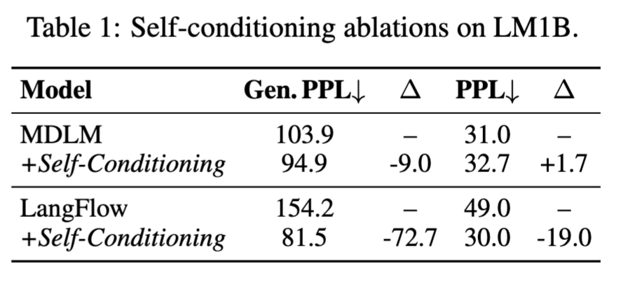

# Hyperbolic DLM

#### July 2, 2026

---

---

---

Define MMSE

Define $\gamma(u)$

---

Define the information profile $\rho^*(u)$

InfoNoise samples thetimestep $u$ from the information profile $\rho^*(u)$

---

The paper also visualizes the information profile along with the Bayes posterior uncertainty. 

---

It claims that sampling the timestep $u$ from the information profile $\rho^*(u)$ can (1) Reduce Variance (2) Reduce training iteration (3) Without additional model training for timestep allocation

However, it doesn't provide optimal guarantee.

---

---

# H-FLM Curvature * Init * LR on Sudoku

---

## Curvature * Init * LR Exp: Setting Up

- Data: Sudoku, **48k train / 2k val** per difficulty (seed 42)
  - Difficulties: {med 35 / hard 30}
- Model (DiT, *tiny*): Width **512**, Depth **8**, Heads **8** (~28.6M)

- Model Initialization Choice ($\mathcal{N}(mean, var)$)
  - ``ngpt``: $\mathcal{N}(0, \frac{1}{d})$, ``random``: $\mathcal{N}(0, 4e-4)$
  - ``custom``: std: {0.01, 0.04, 0.06, 0.08}

- Geometry Curvature: {-0.25, -0.3, -0.5, -0.7, -1.0, -1.5}

---

## Curvature * Init * LR Exp: Setting Up

- Training
  - Training Steps: **20k**, Batch Size: **256**, Max Seq Len: **180**, bf16, EMA 0.9999
  - Optimizer: AdamW
    - LR: {1e‑4, 3e‑4, 5e‑4, 1e‑3}
    - Weight Decay: 0.0, Betas: (0.9, 0.999), eps: 1e-8, Gradient Clip: 1.0
  - All use cross entropy loss
  - 3 radom seeds: {1, 2, 3}, take averge

---

## Curvature * Init * LR Exp: Setting Up

- Evaluation
  - Exact-velocity, top_k_v = -1 (avg across vocab), 180 sampling steps
  - Greedy decoding for last sampling step

---

## Environment

- Exp name: ``hflm_curv_init_lr_sudoku``
- Use both ``desa`` and ``thickstun`` partition on unicorn and any available GPUs on Tinkercliffs and Falcon. Read Agent.md for more server details. For Tinkercliffs and Falcon, use ``/home/shengyenc/workspace/research/s-flm`` as working directory.
- Refer to ``experiments/hflm_curv_sudoku/sweep.py`` for the ``sweep.py`` format
- Prioritize Init {``random``} * LR {3e‑4, 1e-3} * Curvature {-0.25, -0.3, -0.5, -0.7, -1.0, -1.5}

---

# H-FLM Curvature + Init on Sudoku (3 Seeds Avg)

 

**1008 runs** — 6 curvatures × 7 inits × 4 LRs × {medium, hard} × **3 seeds**, averaged.

Color legend: <rd>red = K = −1.0 baseline to beat</rd> (the standard unit hyperboloid).

---

## Mild curvature beats the unit hyperboloid — a robust, distribution-wide lift

Seed-averaged accuracy over the full 84-run init×LR×seed grid per K (**bold** = peak):

| K → | −0.25 | −0.3 | −0.5 | −0.7 | <rd>−1.0</rd> | −1.5 |
|:--|--:|--:|--:|--:|--:|--:|
| **Medium** | 74.2 | **76.7** | 75.3 | 74.5 | <rd>71.8</rd> | 67.4 |
| **Hard** | 30.4 | 32.5 | **34.2** | 32.9 | <rd>27.8</rd> | 24.1 |

- Inverted-U (grid mean, *n*=84/K): peaks at **K=−0.3** (medium, **+4.9 pt** vs baseline, *p*=1.7e-7) and **K=−0.5** (hard, **+6.4 pt**, *p*=2.8e-7)
- Holds within **every** LR and under a paired test → not an LR confound. High curvature <rd>K=−1.5 is reliably worst</rd> (>2σ)

---

## But no single configuration provably beats the baseline

Best *individual cell* per curvature vs its seed noise (pooled 2·SE ≈ **9 pt** medium / **11 pt** hard):

| | best cell (init@lr) | acc ± seed-std | Δ vs <rd>K=−1.0</rd> best (2·SE bar) |
|:--|:--|--:|--:|
| **Medium** peak −0.3 | c0.01 @ 5e-4 | 83.2 ± 4.5 | +2.3 &nbsp;(2·SE ≈ 9) |
| **Hard** peak −0.5 | c0.01 @ 3e-4 | 46.2 ± 10.7 | +5.8 &nbsp;(2·SE ≈ 11) |

- Every per-K best cell's edge over baseline is **smaller than its own seed spread** → within noise
- The curvature win is real **only on average**; report the *aggregate* effect, never a "winning" config

---

## Three seeds overturned the single-seed story: +20 pt → +10 pt → n.s.

The prior "K=−0.5 beats K=−1.0 by ~20 pt" (medium, random @ 1e-3) was **one unlucky baseline seed**:

| medium, random@1e-3 | seed 1 | seed 2 | seed 3 | mean |
|:--|--:|--:|--:|--:|
| K = −0.5 | 84.2 | 80.8 | 83.0 | 82.7 |
| <rd>K = −1.0 (baseline)</rd> | <rd>64.4</rd> | 78.3 | 74.6 | <rd>72.4</rd> |

- Single-seed gap **84.2 − 64.4 = +19.8 pt** → seed-averaged **+10.3 pt** → best-cell-vs-best-cell **+1.8 pt (n.s.)**
- The entire "effect" lived in one <rd>64.4%</rd> outlier — the case *for* running multiple seeds

---

## Init and LR are second-order — the init winner even flips by difficulty

Init strength (mean over all K, LR, seed) — spread ~2 pt, **within** cross-cell noise:

| | ngpt | random | c0.01 | c0.02 | c0.04 | c0.06 | c0.08 |
|:--|--:|--:|--:|--:|--:|--:|--:|
| Medium | 73.6 | 73.9 | 73.4 | **75.3** | 73.4 | 71.2 | 72.4 |
| Hard | 30.8 | 28.6 | **32.9** | 28.7 | 30.8 | 30.5 | 29.9 |

LR strength (mean over all K, init, seed) — the one clear knob:

| | 1e-4 | 3e-4 | 5e-4 | 1e-3 |
|:--|--:|--:|--:|--:|
| Medium | <rd>67.8</rd> | 74.6 | **75.5** | 75.3 |
| Hard | <rd>25.9</rd> | **33.5** | 32.9 | 29.0 |

- Init winner flips (**c0.02** medium / **c0.01** hard); large inits weakest; **ngpt does not collapse** here (unlike TinyStories)
- <rd>LR=1e-4 is clearly too low</rd> (−7 pt); 3e-4/5e-4 best; 1e-3 fades on hard

---

## Takeaways

- **Curvature is a real, free hyperparameter for H-FLM** — a ~+5 pt aggregate lift over the K=−1.0 default, larger as the task gets harder
- **Operating region:** curvature <uv>K ∈ [−0.3, −0.7]</uv>, LR ∈ {3e-4, 5e-4}, small init (c0.01/c0.02); avoid the <rd>K=−1.0 default</rd> and K ≤ −1.5
- **Methodological:** single-seed sudoku accuracy is noisy (σ≈6 pt on hard) — the curvature effect is only trustworthy seed- and grid-averaged, not per-config

---

