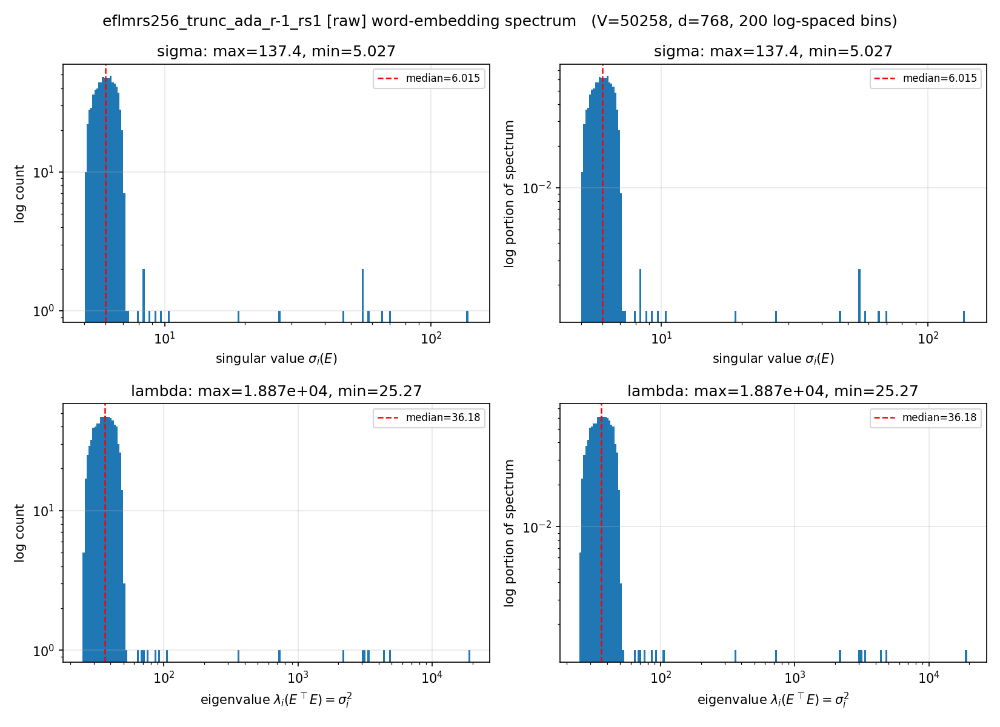

# Hyperbolic DLM

#### July 25, 2026

---

# Rescale Word Embedding for EFLM on Sudoku Hard

---

## Rescale EFLM * {w/ Ada, w/o Ada}, Sudoku  Exp: Setting Up

- Data: Sudoku, **48k train / 2k val** per difficulty (seed 42)
  - Difficulty: **hard 30** (only difficulty run in this sweep)
- Model (DiT, *tiny*): Width **512**, Depth **8**, Heads **8** (~28.6M)

- Model Initialization Choice ($\mathcal{N}(mean, var)$)
  - EFLM:
    - ``ngpt``: $\mathcal{N}(0, \frac{1}{\sqrt{d}})$ (= custom 0.0441
- ``rho``: ``rho_min`` == ``rho_max`` == R, (radius $R$, trunc $\alpha^*(R)$) list
  - {(0.1, ), (0.5, ), (1.0, ), (1.5, ), (2.0, ), (5.0, ), (8.0, ), (16.0, ), (22.0, ), (32.0, )}
  - Truncated at the Eq. 17 bound α⋆(R) = `alpha_star_euclidean(V=12, R)` &nbsp;<small>
- Schedulers: `naive` (fixed log-linear), `trunc` (fixed log-linear, cut at $\alpha^*(R)$), `ada` (adaptive)
---

## Rescale EFLM * {w/ Ada, w/o Ada}, Sudoku  Exp: Setting Up

- Training
  - Training Steps: **20k**, Batch Size: **256**, Max Seq Len: **180**, bf16, EMA 0.9999
  - Optimizer: AdamW
    - LR: {3e‑4, 5e‑4, 1e‑3}
    - Weight Decay: 0.0, Betas: (0.9, 0.999), eps: 1e-8, Gradient Clip: 1.0
  - All use cross entropy loss
  - 3 radom seeds: {1, 2, 3}, take averge

---

## Rescale EFLM * {w/ Ada, w/o Ada}, Sudoku  Exp: Setting Up

- Evaluation
  - Exact-velocity, top_k_v = -1 (avg across vocab), 180 sampling steps
  - Greedy decoding for last sampling step

---

## Rescale EFLM, Sudoku Hard — `naive` (fixed log-linear)

<small>mean ± seed-std, n=3; cols = LR</small>

| R | 3e-4 | 5e-4 | 1e-3 |
|:--|--:|--:|--:|
| 0.1 | 0.218 ± 0.061 | 0.217 ± 0.019 | 0.222 ± 0.042 |
| 0.5 | 0.394 ± 0.016 | 0.347 ± 0.041 | 0.435 ± 0.058 |
| 1 | 0.395 ± 0.047 | 0.415 ± 0.026 | 0.413 ± 0.004 |
| 1.5 | 0.419 ± 0.053 | 0.433 ± 0.035 | 0.400 ± 0.068 |
| 2 | 0.423 ± 0.027 | 0.411 ± 0.032 | <rd>**0.440 ± 0.068**</rd> |
| 5 | 0.333 ± 0.068 | 0.400 ± 0.004 | 0.396 ± 0.042 |
| 8 | 0.306 ± 0.021 | 0.302 ± 0.026 | 0.321 ± 0.031 |
| 16 | 0.202 ± 0.073 | 0.236 ± 0.045 | 0.187 ± 0.064 |
| 22 | 0.181 ± 0.034 | 0.249 ± 0.040 | 0.189 ± 0.112 |
| 32 | 0.088 ± 0.070 | 0.162 ± 0.054 | 0.158 ± 0.123 |

- <rd>**Inverted-U in R**</rd>: 0.22 (R=0.1) → peak **0.44 (R=2)** → collapse **0.16 (R=32)**

---

## Rescale EFLM, Sudoku Hard — `trunc` (fixed, cut at α⋆(R))

| R | α⋆(R) | 5e-4 | 1e-3 | best over offsets {α⋆±0.1} |
|:--|--:|--:|--:|--:|
| 1 | 0.767 | 0.357 ± 0.027 | 0.397 ± 0.014 | 0.397 |
| 2 | 0.622 | 0.468 ± 0.056 | 0.416 ± 0.019 | <rd>**0.468**</rd> |
| 5 | 0.396 | 0.428 ± 0.061 | 0.375 ± 0.033 | 0.464 |
| 8 | 0.291 | 0.400 ± 0.019 | 0.362 ± 0.033 | 0.426 |
| 16 | 0.170 | 0.398 ± 0.069 | 0.392 ± 0.065 | 0.416 |
| 32 | 0.093 | 0.394 ± 0.052 | 0.357 ± 0.046 | 0.433 |

- Static truncation <rd>**turns the large-R collapse into a flat ~0.42–0.43**</rd> —
- **R sets the decode time, trunc and ada shape the scheduler for better Acc.**
- Large R brings earlier truncation (decided generated token earlier)
- Small R (<= 1.0): sub-optimal -> Guess: too early truncation + cliff at the end
- Large R (> 5.0): sub-optimal -> Guess: too early truncation

---

## Rescale EFLM, Sudoku Hard — `ada` (adaptive log-linear)

<small>(mean ± seed-std, n=3; cols = LR)</small>

| R | 3e-4 | 5e-4 | 1e-3 |
|:--|--:|--:|--:|
| 0.1 | 0.292 ± 0.070 | 0.304 ± 0.072 | 0.295 ± 0.039 |
| 0.5 | 0.383 ± 0.018 | 0.440 ± 0.074 | 0.425 ± 0.029 |
| 1 | 0.406 ± 0.068 | 0.388 ± 0.091 | 0.418 ± 0.032 |
| 1.5 | 0.422 ± 0.039 | 0.426 ± 0.053 | 0.429 ± 0.038 |
| 2 | 0.416 ± 0.069 | 0.446 ± 0.019 | 0.448 ± 0.019 |
| 5 | 0.435 ± 0.094 | 0.469 ± 0.030 | <rd>**0.539 ± 0.041**</rd> |
| 8 | 0.480 ± 0.093 | 0.463 ± 0.022 | 0.488 ± 0.054 |
| 16 | 0.427 ± 0.046 | 0.422 ± 0.061 | 0.476 ± 0.076 |
| 22 | 0.389 ± 0.090 | 0.468 ± 0.037 | 0.417 ± 0.029 |
| 32 | 0.320 ± 0.078 | 0.505 ± 0.019 | 0.370 ± 0.096 |

---

## Rescale EFLM, Sudoku Hard — Schedulers Side by Side

Best cell per R (best over LR; for `trunc`, also over offset)

| R | 0.1 | 0.5 | 1 | 1.5 | 2 | 5 | 8 | 16 | 22 | 32 |
|:--|--:|--:|--:|--:|--:|--:|--:|--:|--:|--:|
| predicted t⋆(R) | 0.03 | 0.13 | 0.23 | 0.31 | 0.38 | 0.60 | 0.71 | 0.83 | 0.87 | 0.91 |
| naive | 0.222 | 0.435 | 0.415 | 0.433 | 0.440 | 0.400 | 0.321 | 0.236 | 0.249 | 0.162 |
| trunc | — | — | 0.397 | — | 0.468 | 0.464 | 0.426 | 0.416 | — | 0.433 |
| ada | 0.304 | 0.440 | 0.418 | 0.429 | 0.448 | <rd>**0.539**</rd> | 0.488 | 0.476 | 0.468 | 0.505 |

- **R sets the decode time, trunc and ada shape the scheduler for better Acc.**
- Large R brings earlier truncation (decided generated token earlier)
- Small R (<= 1.0): sub-optimal -> Guess: too early truncation + cliff at the end
- Large R (> 5.0): sub-optimal -> Guess: too early truncation
- Ada can fix the early truncation issue, but not the cliff

---

# Rescale Word Embedding for EFLM on Tinystories

---

## Rescale EFLM - TinyStories Exp Setup

- Data: TinyStories, **475M train / 5M val** (seed 42)
- Model (DiT, *small*): Width **768**, Depth **12**, Heads **12**, Init ``ngpt``: $\mathcal{N}(0, \frac{1}{d})$ (variance)

- Sched: {Naive, ada sched, truncation, ada sched + truncation}
- Self Cond: Off
- Radius & Trunc: {(1.0, 0.84), (8.0, 0.397), (28.0, 0.158)}

Note that timestep 0 is pure noise

---

## Rescale EFLM - TinyStories Exp Setup

- Training
  - Training Steps: **30K**, Batch Size: **512**, Max Seq Len: **{256}**, bf16, EMA 0.9999
  - Optimizer: AdamW
    - LR: 3e-4, Weight Decay: 0.0
    - Betas: (0.9, 0.999), eps: 1e-8, Gradient Clip: 1.0
  - All use cross entropy loss

- Evaluation
  - Exact-velocity, top_k_v = 1 (top-1), 180 sampling steps
  - Greedy decoding for last sampling step

---

## Rescale EFLM - TinyStories Exp Results

| arm | R | valid PPL† | GenPPL | entropy |
|---|---|---|---|---|
| ada | 1 | 24.11 | 12.57 | 3.80 |
| ada | 8 | 4.99 | 17.87 | 3.92 |
| ada | 28 | 2.48 | 20.35 | 3.89 |
| trunc | 1 | 58.15 | 12.78 | 3.75 |
| trunc | 8 | 10.70 | 16.72 | 3.88 |
| trunc | 28 | 7.06 | 18.39 | 3.90 |
| **trunc_ada** | **1** | 36.70 | **10.99** | 3.69 |
| trunc_ada | 8 | 13.87 | 15.11 | 3.90 |
| trunc_ada | 28 | 10.87 | 15.86 | 3.93 |
| *baseline: naive_geo eflm (raw norms)* | — | *1.10* | *34.58* | *3.67* |
| *baseline: SFLM + trunc + ada (LR=5e-3, tuned)* | — | *10.95* | *11.02* | *3.90* |
| *baseline: SFLM + trunc + ada (LR=3e-4)* | — | *11.99* | *14.39* | *3.94* |

<!-- <small>SFLM baselines = `sfm_ada_trunc_lr{5e-3,3e-4}` from
`experiments/adv_geo_tinystories_s256/RESULTS.md`. The tuned cell is
<rd>LR=5e-3</rd>, not 1e-3 (LR=1e-3 gives GenPPL 12.29 / PPL 12.18 / ent 3.94).</small> -->

---

## The Root Causes

---

---

1. Word embedding changes along time, causing the loss curve varies for different word embeddings
2. Non-constant angular movement
3. The truncation predicted by random code book isn't accurate

---

1. Word Embeddings have various lengths
  -> Sol: Normalized to R
2. Curve changes along with radius R
  -> Sol: time invariant drift via re-parametrized timestep + ELBO weighted
3. Voronoi Cone varies for each word
  -> Sol: Diffusion jump?

---

# For Issue 2: Time Invariant Drift (Autonomous Flow)

---

## Autonmous Flow - Diffusion Types
- Brownian Bridge
- Flow Matching

---

## The Problem: A Non-Autonomous Drift

A Euclidean Brownian bridge conditioned on $X_T = y$ (with $\|y\| = R$) obeys

$$
dX_t = \frac{y - X_t}{T - t}\,dt + dW_t
$$

- The $\dfrac{1}{T-t}$ factor comes from **conditioning on arrival at a finite time** $T$
- The drift is <rd>time-dependent</rd> and <rd>blows up</rd> as $t \to T$

---

## Autonmous Brownian Bridge

---

## The Idea: An Infinite-Time Clock

Re-parameterize time so the terminal instant $t=T$ maps to $\tau = \infty$:

$$
\tau = -\log\frac{T-t}{T},
\qquad
t = T\left(1 - e^{-\tau}\right)
$$

- This stretches the finite horizon $[0, T)$ onto $[0, \infty)$
- Key relation for the change of variables: $\;dt = (T-t)\,d\tau$

$$
\frac{d \tau}{d t} 
= - \frac{1}{\frac{T-t}{T}} \frac{1}{dt} \frac{T-t}{T}
= \frac{1}{\frac{T-t}{T}} \frac{1}{T}
= \frac{1}{T-t}
$$

---

## The Idea: An Infinite-Time Clock - Weighted CE Loss

---

## Autonmous Flow Matching

---

# Autonomous Flow on Tinystories

---

## Rescale + Auto + SNR CE EFLM - TinyStories Exp Setup

- Data: TinyStories, **475M train / 5M val** (seed 42)
- Model (DiT, *small*): Width **768**, Depth **12**, Heads **12**, Init ``ngpt``: $\mathcal{N}(0, \frac{1}{d})$ (variance)

- Sched: {w/, w/o ada} * {w/, w/o trunc} + {w/, w/o trunc} * {SNR CE}
- Self Cond: Off
- Radius & Trunc: {(0.5, ), (1.0, 0.84), (5.0, ), (8.0, 0.397), (28.0, 0.158)}

Note that timestep 0 is pure noise

---

## Rescale + Auto + SNR CE EFLM - TinyStories Exp Setup

- Training
  - Training Steps: **30K**, Batch Size: **512**, Max Seq Len: **{256}**, bf16, EMA 0.9999
  - Optimizer: AdamW
    - LR: 3e-4, Weight Decay: 0.0
    - Betas: (0.9, 0.999), eps: 1e-8, Gradient Clip: 1.0
  - All use cross entropy loss

- Evaluation
  - Exact-velocity, top_k_v = 1 (top-1), 180 sampling steps
  - Greedy decoding for last sampling step

---

## Tinystories, GenPPL

| arm | R=0.5 | R=1 | R=5 | R=8 | R=16 | R=28 |
| --- | --- | --- | --- | --- | --- | --- |
| auto, untrunc, CE | 18.90 | 21.07 | 36.73 | 48.92 | 69.77 | 100.82 |
| auto, trunc, CE | **11.81** | **12.56** | **17.25** | — | — | — |
| auto, untrunc, ada, CE | — | — | — | — | — | — |
| auto, trunc, ada, CE | — | — | — | — | — | — |
| auto, untrunc, SNR CE | — | — | — | — | — | — |
| auto, trunc, SNR CE | — | — | — | — | — | — |

---

## Tinystories, Entropy

**Entropy** (≥3.0 = not degenerate)

| arm | R=0.5 | R=1 | R=5 | R=8 | R=16 | R=28 |
| --- | --- | --- | --- | --- | --- | --- |
| auto, untrunc, CE | 3.87 | 3.88 | 3.80 | 3.77 | 3.73 | 3.56 |
| auto, trunc, CE | 3.82 | 3.83 | 3.85 | — | — | — |
| auto, untrunc, ada, CE | — | — | — | — | — | — |
| auto, trunc, ada, CE | — | — | — | — | — | — |
| auto, untrunc, SNR CE | — | — | — | — | — | — |
| auto, trunc, SNR CE | — | — | — | — | — | — |

---

## Tinystories, Valid PPL

**Valid PPL** — the flow bound. Not comparable across arms

| arm | R=0.5 | R=1 | R=5 | R=8 | R=16 | R=28 |
| --- | --- | --- | --- | --- | --- | --- |
| auto, untrunc, CE | 3.25 | 2.20 | 1.29 | 1.19 | 1.10 | 1.06 |
| auto, trunc at τ*(R), CE | 26.38 | 18.11 | 9.01 | — | — | — |
| auto, untrunc, ada, CE | — | — | — | — | — | — |
| auto, trunc, ada, CE | — | — | — | — | — | — |
| auto, untrunc, SNR CE | — | — | — | — | — | — |
| auto, trunc, SNR CE | — | — | — | — | — | — |

---

# For Issue 3: Diffusion Jump

---

- The eigenvalue distribution of the word embedding matrix is skew, concentrating on specific direction
- Random codebook assumption doesn't hold

---

